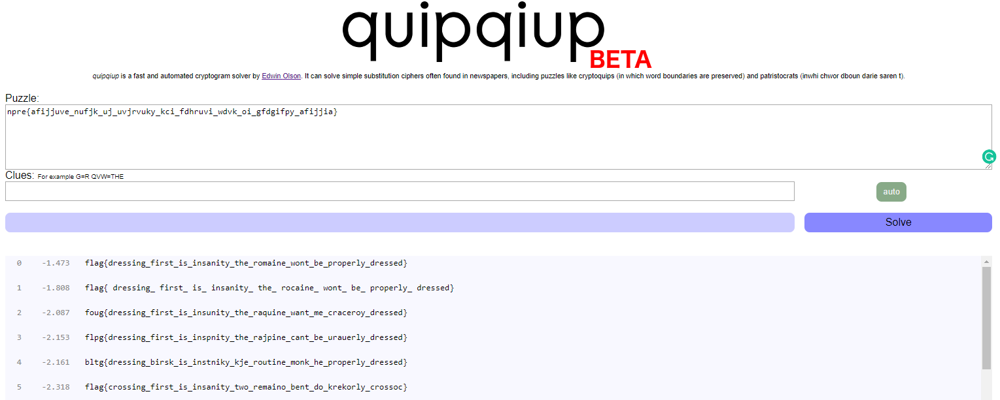

# Caesar Salad Cipher Part 2


Write up By
**Robe Zhang** [ThirdRepublic](https://github.com/ThirdRepublic)

## Challenge Description
> Oh no! Someone messed with the permutations of ingrediants and now I have no clue how to decipher the message! Try and recover the plaintext! <br /> <br />
*Alphabet: abcdefghijklmnopqrstuvwxyz{}_* <br /> <br />
Ciphertext: npre{afijjuve_nufjk_uj_uvjrvuky_kci_fdhruvi_wdvk_oi_gfdgifpy_afijjia} 

## Background Information
>> The Caesar Cipher or Caesar Shift is a cipher which uses the alphabet in order to encode texts. [Reference](https://ctf101.org/cryptography/what-is-caesar-cipher-rot-13/)

 <br />
[Read More](https://en.wikipedia.org/wiki/Caesar_cipher)

## Solution
I used [quipqiup](https://www.quipqiup.com/), a fast and automated cryptogram solver by [Edwin Olson](https://april.eecs.umich.edu/people/ebolson/).

 <br />

## Flag
```
flag{dressing_first_is_insanity_the_romaine_wont_be_properly_dressed}
```