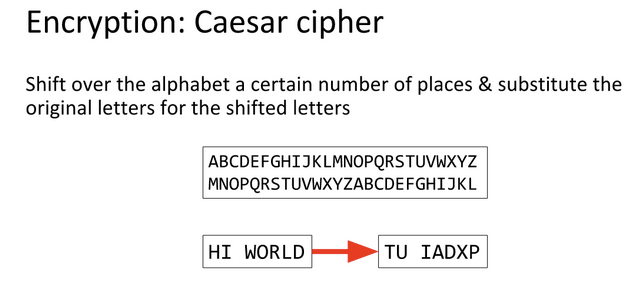
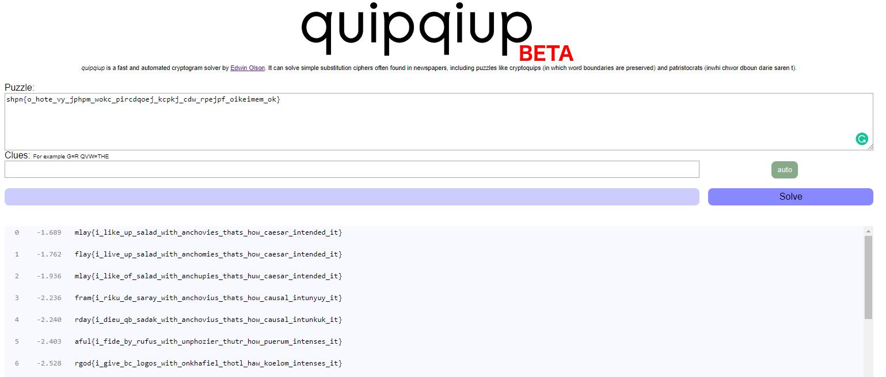

# Caesar Salad Cipher


Write up By
**Robe Zhang** [ThirdRepublic](https://github.com/ThirdRepublic)

## Challenge Description
> Caesar Cipher is outdated, its time to millenialize it and make a Caesar Salad Cipher. Use the lettuce structure in order to get the final substitution cipher required to decode the ciphertext Remember, substitutions are extra! <br /> <br />
*Alphabet: abcdefghijklmnopqrstuvwxyz{}_* <br /> <br />
Ciphertext: shpn{o_hote_vy_jphpm_wokc_pircdqoej_kcpkj_cdw_rpejpf_oikeimem_ok} <br /> <br />
Lettuce Structure: <br />
> 1. romaine
> 2. dressing
> 3. parmesan
> 4. anchovies
> 5. croutons
> 6. parmesan

## Background Information
>> The Caesar Cipher or Caesar Shift is a cipher which uses the alphabet in order to encode texts. [Reference](https://ctf101.org/cryptography/what-is-caesar-cipher-rot-13/)

 <br />
[Read More](https://en.wikipedia.org/wiki/Caesar_cipher)

## Solution
I used [quipqiup](https://www.quipqiup.com/), a fast and automated cryptogram solver by [Edwin Olson](https://april.eecs.umich.edu/people/ebolson/).

 <br />

## Flag
```
flag{i_like_my_salad_with_anchovies_thats_how_caesar_intended_it}
```