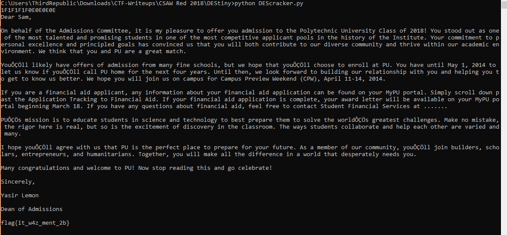

# DEStiny


Write up By
**Robe Zhang** [ThirdRepublic](https://github.com/ThirdRepublic)

## Challenge Description
> I remember when I got the news. It made me weak with joy.

## Attached Files
- [gen.py](gen.py)
- [destiny.enc](destiny.enc)

## Background Information
This challenge involves weak keys in DES encryption. 
>> DES is a symmetric key algorithm.  DES is insecure. This is mainly due to the 56-bit key size being too small.  It is susceptible to brute force attack. [Continue Reading](https://en.wikipedia.org/wiki/Data_Encryption_Standard)

[Weak Keys](https://en.wikipedia.org/wiki/Weak_key) <br />
[Weak Keys](http://www.umich.edu/~x509/ssleay/des-weak.html)


## Solution
I first observed the attached files.  In *gen.py*
```
from Crypto.Cipher import DES
import binascii

key = open('key').read()
iv = '66642069'
cipher = DES.new(key, DES.MODE_OFB, iv)
plaintext = open('plain.txt').read()
msg = iv + cipher.encrypt(plaintext)
with open('destiny.enc', 'w') as f:
	f.write(msg)
```

Based on the generation script, we know the value of *iv* and that the ciphertext is padded with the *iv*.

In order to decrypt the ciphertext, the key has to be found first.  <br />
I created a list of weak keys and looped through each decoding.
```
for x in weakKeys:
	key = x.decode("hex")
	cipher = DES.new(key, DES.MODE_OFB, iv)
	ans = cipher.decrypt(ciphertext)
	if "flag" in ans:
		print x
		print ans
```

 <br />
[DEScracker Script](DEScracker.py)

## Flag
```
flag{it_w4z_ment_2b}
```