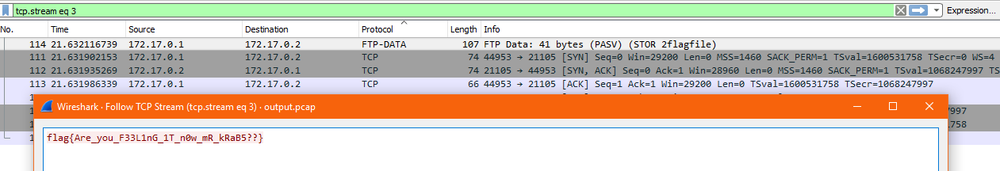

# FeelThePower


Write up By
**Robe Zhang** [ThirdRepublic](https://github.com/ThirdRepublic)

## Challenge Description
> It looks like someone was moving stuff around on Sam's network... hmm...

## Attached Files
- [output.pcap](output.pcap)

## Solution
Opening the pcap file in Wireshark, I observed DNS, FTP, TCP, and FTP-Data Protocols.
>> The File Transfer Protocol (FTP) is a standard network protocol used for the transfer of computer files between a client and server on a computer network. [Reference](https://en.wikipedia.org/wiki/File_Transfer_Protocol)

I looked into both FTP-Data protocols and found the flag in packet 114 <br />
 <br />

## Flag
```
flag{Are_you_F33L1nG_1T_n0w_mR_kRaB5??}
```
