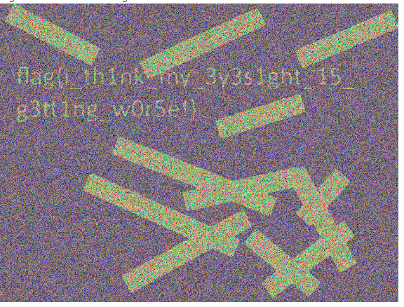

# I'mInTheBand


Write up By
**Robe Zhang** [ThirdRepublic](https://github.com/ThirdRepublic)

## Challenge Description
> Somneone put this up in the lounge, but I can't see anything

## Attached Files
- [output.bmp](output.bmp)

## Background Information
This is a steganography challenge involving LSB
>>LSB Stegonagraphy or Least Significant Bit Stegonagraphy is a method of stegonagraphy where data is recorded in the lowest bit of a byte.
[Reference](https://ctf101.org/forensics/what-is-stegonagraphy/#lsb-stegonagraphy-in-images)

## Solution
Using https://incoherency.co.uk/image-steganography/ with hidden bit set to 7, we get the flag <br />
 <br />

## Flag
```
flag{I_th1nk_my_3y3s1ght_15_g3tt1ng_w0r5e!}
```
