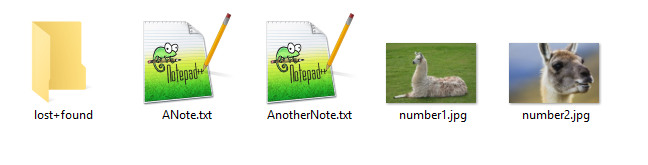
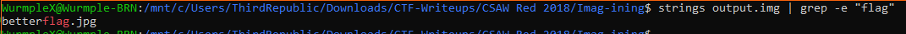
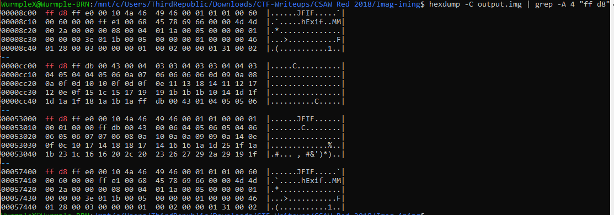

# Imag-ining


Write up By
**Robe Zhang** [ThirdRepublic](https://github.com/ThirdRepublic)

## Challenge Description
> Ohhhhhh say can you seeeeeeeeeeeee

## Attached Files
- [output.img](output.img)

## Background Information
This is a steganography challenge involving file extraction.  It is important to notice what the file signature are in hex. The file signature for jpg/jpeg files are
> FF D8 FF DB
> FF D8 FF E0
> FF D8 FF E1

[List of File Signature](https://en.wikipedia.org/wiki/List_of_file_signatures)

The *.img* file extension is a Disk Image File. 
>> The .img filename extension stores raw disk images of floppy disks, hard drives, and optical discs or a vector image [Reference](https://en.wikipedia.org/wiki/IMG_(file_format))

## Solution
First, I extracted the **output.img** file and obtained a folder, **output**, with the following contents: <br />
 <br />
  
The **lost+found** folder is empty.  The two images and the two text files does not contain the flag.

Next, I used the Linux command, strings piped with grep.
```
strings output.img | grep -i "flag"
```
 <br />

strings Returns each string of printable characters in files. <br />
The *-i* flag ignores case.

I notice that **betterflag.jpg** exist somewhere.  <br />
I hexdumped the **output.img** file looking for possible jpg file signatures.
```
hexdump -C output.img | grep -A 4 "ff d8"
```

The *-C* flag displays the input offset in hexadecimals. <br />
The *-A* flag prints n of lines trailing the context after matching lines. <br />
 <br />

There are four possible images locations. I then hexdumped **number1.jpg** and **number2.jpg** to eliminate two of the four options.  
```
hexdump -C number1.jpg -n 64
00000000  ff d8 ff db 00 43 00 04  03 03 04 03 03 04 04 03  |.....C..........|
00000010  04 05 04 04 05 06 0a 07  06 06 06 06 0d 09 0a 08  |................|
00000020  0a 0f 0d 10 10 0f 0d 0f  0e 11 13 18 14 11 12 17  |................|
00000030  12 0e 0f 15 1c 15 17 19  19 1b 1b 1b 10 14 1d 1f  |................|

hexdump -C number2.jpg -n 64
00000000  ff d8 ff e0 00 10 4a 46  49 46 00 01 01 00 00 01  |......JFIF......|
00000010  00 01 00 00 ff db 00 43  00 06 04 05 06 05 04 06  |.......C........|
00000020  06 05 06 07 07 06 08 0a  10 0a 0a 09 09 0a 14 0e  |................|
00000030  0f 0c 10 17 14 18 18 17  14 16 16 1a 1d 25 1f 1a  |.............%..|
```

With this information, the jpg at addresses **0x0000cc00** and **0x00053000** can be eliminated.  <br />
I then extracted the jpg at address **0x00008c00** with the following Linux command:
```
xxd -p output.img | grep -A 10000 -m 1 "ffd8ffe0" | tr -d '\n' | sed 's/^0*//' | xxd -r -p > output.jpg
```

xxd Creates a hex dump of a file <br />
The *-r* flag is the reverse option.  It converts hex to binary. <br />
The *-p* flag is to read plain hex instead of hex dump format with line number information. <br />
The *-m* flag denotes n number of matchs only. <br />
**tr -d '\n'** remove all occurrences of new line. <br />
**sed 's/^[0]*//'** remove all leading 0. <br />
**xxd -r -p** converts the hex string to binary. 

Volia! There is the flag <br />
 <br />

## Flag
```
flag{pass_me_a_scalpel_first_and_foremost}
```
