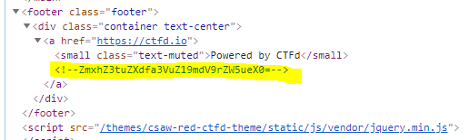

# In My Element


Write up By
**Robe Zhang** [ThirdRepublic](https://github.com/ThirdRepublic)

## Challenge Description
> There is a flag somewhere on this page. Can you find it?

## Solution
Use the Chrome broswer as your tool.  Look in source of the page by clicking F12.  Right click and *Expand Recursively* in elements.
Find a comment within the footer tag. 
  
<!--ZmxhZ3tuZXdfa3VuZ19mdV9rZW5ueX0=-->
Observe that the comment is base64 encoded.  Use https://www.asciitohex.com/ to decode it.

## Flag
```
flag{youtu.be/_RWWKFqv7EM}
```
