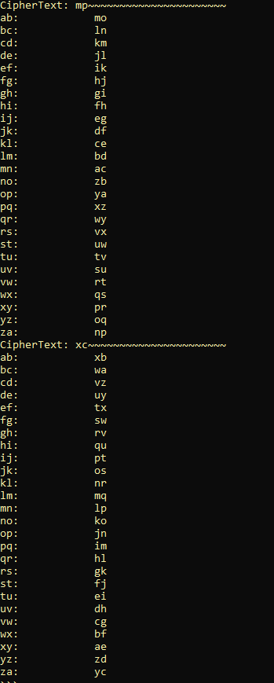

# Interactive Vision Air


Write up By
**Robe Zhang** [ThirdRepublic](https://github.com/ThirdRepublic)

## Challenge Description
> We got an awesome new take on the visionair cipher that iterates over a key in order to encrypt/decrypt flags. Basically we iterate over a key for a length l and encrypt the plaintext using that chunk of the key. The ciphertext is made up of chunks of size l of each individual cipher. The cipher text is *fmcj{aj_rzxn_mpxc_knwxabb}*. Use the flag format to your advantage in cracking the code.

## Background Information
This challenge involves the using the Vigenère cipher.  
>> A Vigenere Cipher is an extended Caesar Cipher where a message is encrypted using various Caesar shifted alphabets. [Continue Reading](https://ctf101.org/cryptography/what-is-a-vigenere-cipher/)

[Read More](https://en.wikipedia.org/wiki/Vigen%C3%A8re_cipher)

## Solution
In order to decrypt the ciphertext, the key has to be found first.  <br />
Knowing that the structure of the flag begins with *flag{*, I wrote a function, findkey which returns the correct single byte key as a chr.
```
def findKey(plainText,cipherText):
	print "CipherText: " + cipherText + "~~~~~~~~~~~~~~~~~~~~~~"
	output = ""
	for x in range(len(plainText)):
		for y in range(26): 
			asciiCode = ord(plainText[x])-97+y
			asciiChr = chr(asciiCode%26 + 97)
			if asciiChr == cipherText[x]: 
				output += alpha[y]
	print output + ":            " + plainText
```

 <br />

So the key is *abcd*  <br />
Using this key over and over again didn't give us a flag. <br /> 
After some digging around, I noticed a pattern that the key is incrementing by a single character, so I wrote a test function to display all the possible keys for a given ciphertext.
```
def test(cipher):
	print "CipherText: " + cipher + "~~~~~~~~~~~~~~~~~~~~~~"
	start = 0
	while start < 26:
		print alpha[start:start+len(cipher)] + ":            " + decode(cipher,alpha[start:start+len(cipher)])
		start+=1 
	
def decode(cipher,key):
	output = ""
	for x in range(len(cipher)):
		diff = abs(ord(cipher[x])-97) - abs(ord(key[x])-97)
		output += chr(diff%26 + 97)
	return output
```

I defined each chuck of the ciphertext as such:
```
c1 = "fmcj"
c2 = "aj"
c3 = "rzxn"
c4 = "mpxc"
c5 = "knwxabb"
```

 <br />
For *c2*, the possible *key: plaintext* combinations are:
- ef: we
- uv: go 

I was unsure which option was correct. 

 <br />
For *c3*, the possible *key: plaintext* combination is:
- klmn: hola 

I was unsure if *hola* was the correct option since *flag{we_hola_XXXX_XXXXXXX}* nor *flag{go_hola_XXXX_XXXXXXX}* makes much sense.  

 <br />
For *c4*, no valid *key: plaintext* combination exist.

 

For *c5*, the possible *key: plaintext* combination is:
- stuvwxy: succeed 

That makes some sense since we have the options:
- *flag{we_hola_XXXX_succeed}*
- *flag{go_hola_XXXX_succeed}* 

Since I was unsure about *c3* and *c4*, I decided to breakup the ciphertext further into chunks of size 2.
```
test(c3[:2])
test(c3[2:]) 
```
 <br />
- kl: ho 
- ij: pe

*hope* seems to be the correct word.  *flag{we_hope_XXXX_succeed}* or *flag{go_hope_XXXX_succeed}*

```
test(c4[:2]) 
test(c4[2:])   
```
 <br />
- op: ya 

I was unable to find a match for the second chunk and made a guess: *flag{we_hope_yaXX_succeed}* <br />
*flag{we_hope_yall_succeed}* is correct!

[Interactive Vision Air Script](Interactive Vision Air.py)

## Flag
```
flag{we_hope_yall_succeed}
```