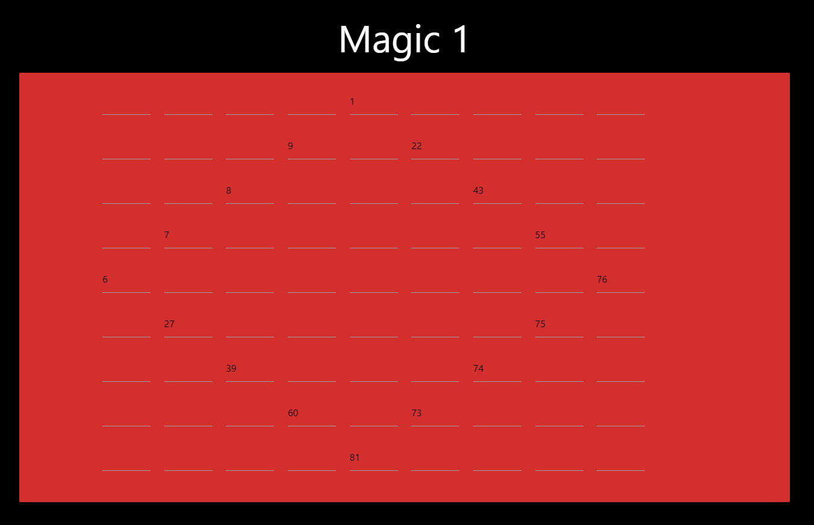

# Magic 1


Write up By
**Robe Zhang** [ThirdRepublic](https://github.com/ThirdRepublic)

## Challenge Description
> Do you believe in magic?
```
http://misc.chal.csaw.io:10102
```

## Background Information
The premise of this problem is Magic Squares.  
>> In recreational mathematics and combinatorial design, a magic square is a square grid filled with distinct positive integers in the range such that each cell contains a different integer and the sum of the integers in each row, column and diagonal is equal. [Reference](https://en.wikipedia.org/wiki/Robots_exclusion_standard)

For an odd magic squares problem, the [Siamese method](https://en.wikipedia.org/wiki/Siamese_method) can be used to solve the problem.  
[Read more](http://mathworld.wolfram.com/MagicSquare.html) about magic squares. 

## Solution
The magic squares problem we were given is a 9 by 9. <br />
 <br />
Parts of this magic square was already completed.  By observing the 1 placed in the center of the first row, I suspected that the Siamese method was used.  Following the Siamese method, I completed the magic square. A magic square generator such as https://www.dcode.fr/magic-square can be used to obtain the answer as well.

## Flag
```
flag{b_th3r3_0r_bee_squ4re}
```
