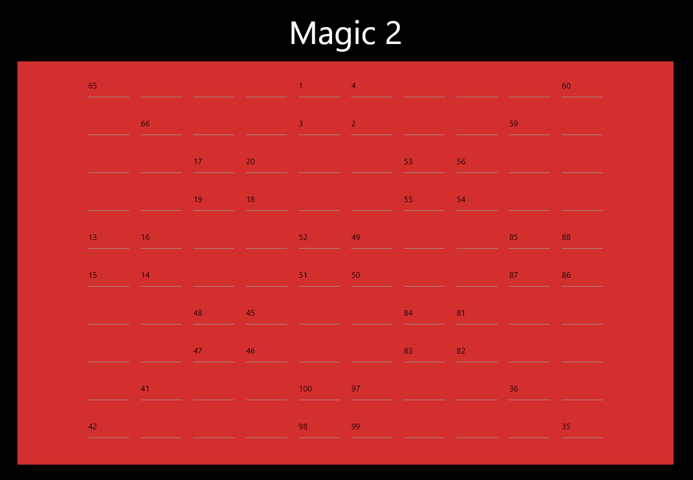
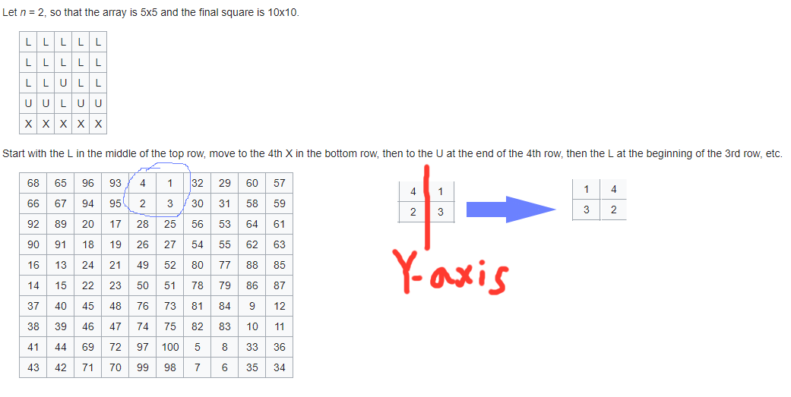

# Magic 2


Write up By
**Robe Zhang** [ThirdRepublic](https://github.com/ThirdRepublic)

## Challenge Description
> Magic is more complicated than you think
```
http://misc.chal.csaw.io:10103
```

## Background Information
The premise of this problem is Magic Squares.  
>> In recreational mathematics and combinatorial design, a magic square is a square grid filled with distinct positive integers in the range such that each cell contains a different integer and the sum of the integers in each row, column and diagonal is equal. [Reference](https://en.wikipedia.org/wiki/Robots_exclusion_standard)

For an even magic squares problem, the [Conway's LUX method](https://en.wikipedia.org/wiki/Conway%27s_LUX_method_for_magic_squares) can be used to solve the problem.  
[Read more](http://mathworld.wolfram.com/MagicSquare.html) about magic squares. 

## Solution
The magic squares problem we were given is a 10 by 10. Parts of this magic square was already completed. <br />
 <br />
By taking the sum of the diagonal, I knew that the magic total was 505.  
By referencing the wiki diagram of Conway's LUX method, I figured out that each 2x2 block was reflected over the Y-axis. <br />
 <br />
I completed the rest of the magic square with this observation.

## Flag
```
flag{y3r_a_wiz3rd_h4rry}
```
