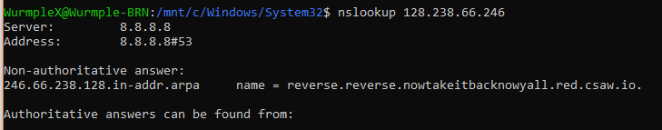

# MirrorMirror


Write up By
**Robe Zhang** [ThirdRepublic](https://github.com/ThirdRepublic)

## Challenge Description
> Who's the fairest?
NOTE: You do NOT need nmap for this challenge
```
128.238.66.246
```

## Solution
An IP address is given.  What can you do with an IP address? <br />
Using [Nmap](https://nmap.org/)
> nmap 128.238.66.246

 <br />

Using [nslookup](https://en.wikipedia.org/wiki/Nslookup) 
> nslookup 128.238.66.246

 <br />

Accessing http://reverse.reverse.nowtakeitbacknowyall.red.csaw.io/ yields the flag <br />
 <br />

## Flag
```
flag{awww_yeah_now_everybody_clap_your_hands}
```
