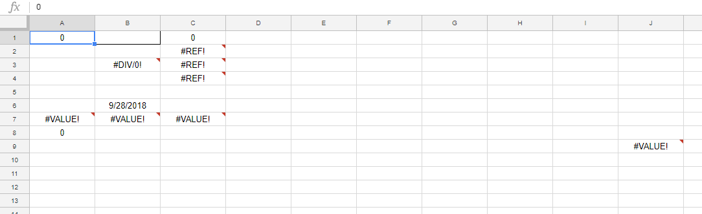
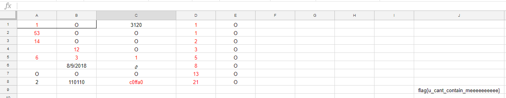

# Mitochondria


Write up By
**Robe Zhang** [ThirdRepublic](https://github.com/ThirdRepublic)

## Challenge Description
> Are you the powerhouse of the cell?
https://docs.google.com/spreadsheets/d/180pLmNAfKWJ5R1sUqqhQbaHr9XWoeD1puHVboWuU5Oc/edit?usp=sharing

## Background Information
The objective of the challenge is to fill out the Google Sheet in such a way to invoke function in cell *J9*
```
=IMPORTDATA(CONCATENATE("http://reversing.chal.csaw.io:10103/submit", "?test=", A1, "&first=", D1:D8, "&second=", A2, "&third=", A3, "&fourth=", C1, "&fifth=", WEEKDAY(A4), "&sixth=", WEEKDAY(B6), "&seventh=", A5, "&eighth=", B5, "&ninth=", C5, "&tenth=", D5, "&eleventh=", C6, "&twelfth=", A8, "&thirteenth=", C8, "&fourteenth=", B8, "&fifteenth=", DEC2HEX(D8), "&sixteenth=", HEX2DEC(B4), "&seventeenth=", D6))
```
The importData function imports data at a given url in .csv format.  To extract the flag from the server, I had to make sure all the parameters are correct.   
The [documentation](https://support.google.com/docs/table/25273?hl=en) for Google sheet functions is quite handy in solving the challenge. 

## Solution
The challenge gave a view only Google Sheet. First, I made a copy of the Google sheet and found addtional functions that needed to be completed. <br />
 <br />
A completed function yields an *O*.  For cell *B1* to be completed, cell *A1* had to contain the value 1. For instance, cell *B1*
```
=IF($A$1 = 1, "O", "")
```

After completing the rest of the functions, I obtained the flag.  <br />
 

**Note** cell *B6* is dynamic, so try incrementing the value by 1 up to 6 for the answer.

## Flag
```
flag{u_cant_contain_meeeeeeeeee}
```
