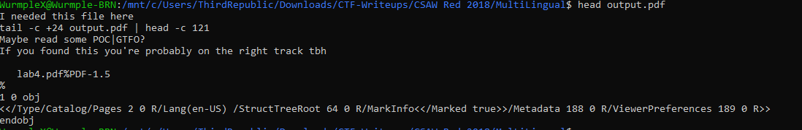
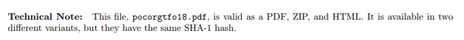
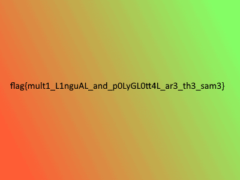

# MultiLingual


Write up By
**Robe Zhang** [ThirdRepublic](https://github.com/ThirdRepublic)

## Challenge Description
> There's something funny about this physics lab...

## Attached Files
- [output.pdf](output.pdf)

## Background Information
This is a steganography challenge involving polyglot files. It is quite interesting how a file can take on many roles.  <br />
[Read More](https://www.alchemistowl.org/pocorgtfo/pocorgtfo18.pdf)

## Solution
First, I visually examined the pdf and found nothing interesting. <br />
Then I used the Linux command head  
```
head output.pdf
```
 <br />

head Displays the beginning of a file <br />
Taking the hint, I went to read some POC||GTFO <br />
 <br />
Interesting stuff! <br />
I changed the extension to zip. <br />
Volia! There is the flag <br />
 <br />

## Flag
```
flag{mult1_L1nguAL_and_p0LyGL0tt4L_ar3_th3_sam3}
```
