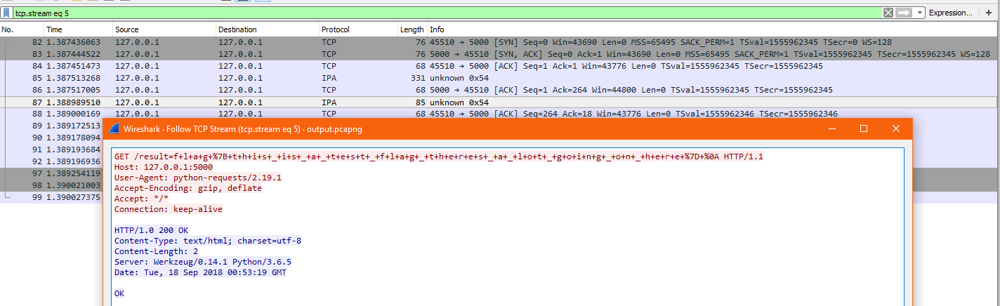
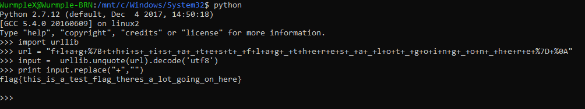

# PacketPacket


Write up By
**Robe Zhang** [ThirdRepublic](https://github.com/ThirdRepublic)

## Challenge Description
> What is this guy doing? Why can I see his traffic?

## Attached Files
- [output.pcapng](output.pcapng)

## Solution
Opening the pcap file in Wireshark, I observed HTTP, IPA, TCP, and TLSv1.2 Protocols.
I filtered the stream begining with 0
> tcp.stream eq 0

After incrementing to 5,
I found a flag <br />
 <br />
> f+l+a+g+%7B+t+h+i+s+_+i+s+_+a+_+t+e+s+t+_+f+l+a+g+_+t+h+e+r+e+s+_+a+_+l+o+t+_+g+o+i+n+g+_+o+n+_+h+e+r+e+%7D+%0A

Then I wrote some python to url decode the string and replaced all the '+' <br />
```
import urllib 
url = "f+l+a+g+%7B+t+h+i+s+_+i+s+_+a+_+t+e+s+t+_+f+l+a+g+_+t+h+e+r+e+s+_+a+_+l+o+t+_+g+o+i+n+g+_+o+n+_+h+e+r+e+%7D+%0A"
input =  urllib.unquote(url).decode('utf8')
print input.replace("+","")
```
 <br />

[PacketPacket Script](PacketPacket.py)

## Flag
```
flag{this_is_a_test_flag_theres_a_lot_going_on_here}
```
