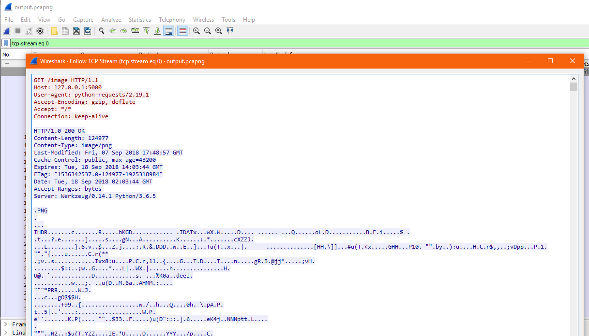
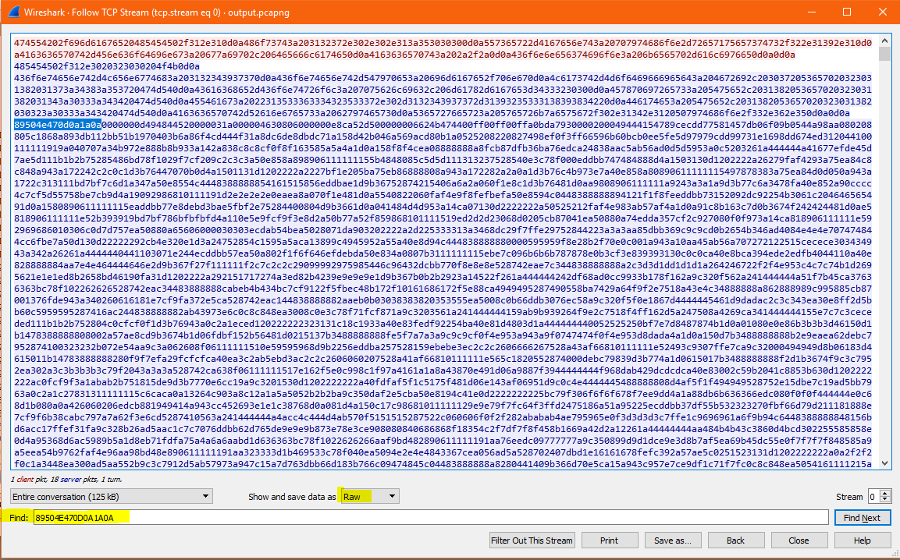
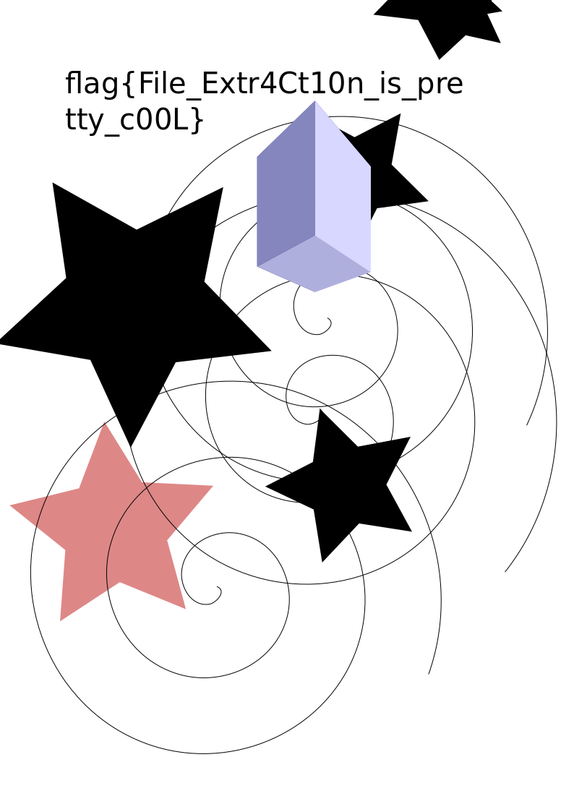

# TheBigPicture


Write up By
**Robe Zhang** [ThirdRepublic](https://github.com/ThirdRepublic)

## Challenge Description
> She just told me to look at the big picture, gave me this, and walked away...

## Attached Files
- [output.pcapng](output.pcapng)

## Background Information
This is a steganography challenge involving file extraction.  It is important to notice what the file signature are in hex. The file signature for PNG files is 
> 89 50 4E 47 0D 0A 1A 0A 

[List of File Signature](https://en.wikipedia.org/wiki/List_of_file_signatures)

## Solution
Opening the pcap file in Wireshark, I observed HTTP, IPA, and TCP Protocols.
I filtered the stream begining with 0
> tcp.stream eq 0

I found a PNG being transfered over the TCP stream<br />
 <br />

I then displayed the data in raw hex form and saved the raw hex starting with the PNG file signature in a text file named **TheBigPicture.txt** 

 <br />

Then I wrote some python to convert the hex string to binary <br />
```
import binascii

file = open("TheBigPicture.txt","r")
output = open("output.PNG", "wb")

for line in file:
	output.write(binascii.unhexlify(''.join(line.split())))
```

Another option to to use the Linux command, xxd
```
xxd -r -p TheBigPicture.txt > output.PNG
```

xxd Creates a hex dump of a file <br />
The *-r* flag is the reverse option.  It converts hex to binary. <br />
The *-p* flag is to read plain hex instead of hex dump format with line number information 

Volia! There is the flag
 <br />

[TheBigPicture Script](TheBigPicture.py)

## Flag
```
flag{File_Extr4Ct10n_is_pretty_c00L}
```
