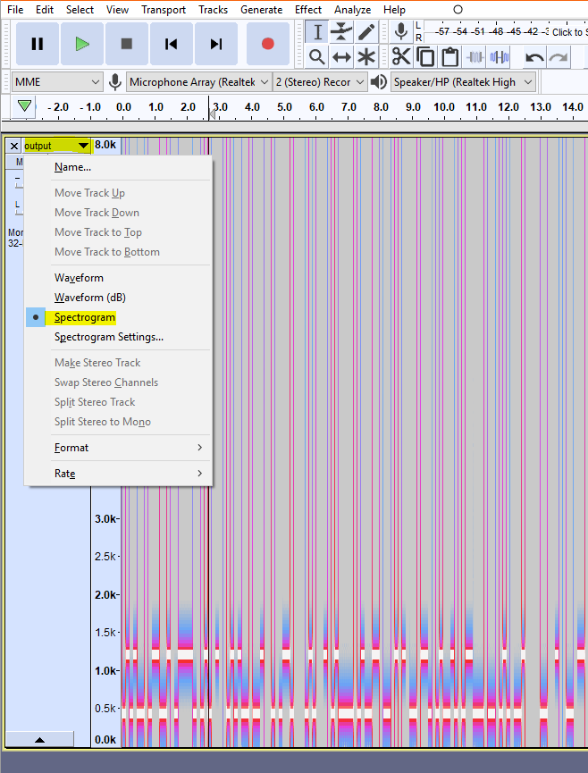
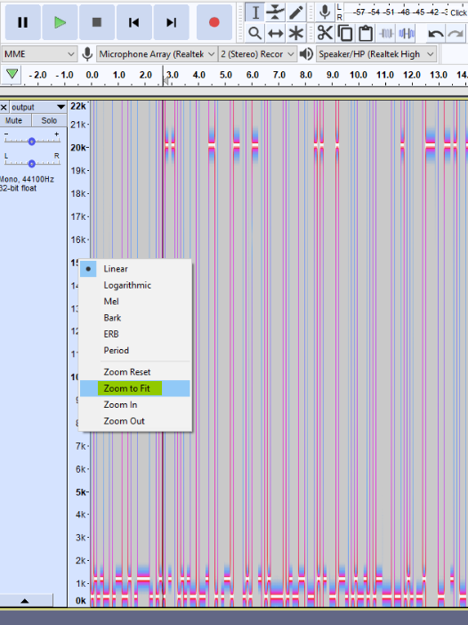
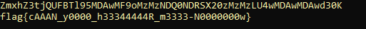

# UltraHyperMegaSonic


 <br />


Write up By
**Robe Zhang** [ThirdRepublic](https://github.com/ThirdRepublic)

## Challenge Description
> 0 1 2 10

## Attached Files
- [output.wav](output.wav)

## Background Information
This is a steganography challenge involving audio analysis. The tool used to analyze audio is [Audacity](https://www.audacityteam.org/). Audio analysis CTF challenges usually involve looking into the spectrogram. <br />

The ternary numeral system or base 3 is used in this challenge.  A trit is the ternary equivalent of a bit with the possible values of 0, 1, and 2. A tryte is a group of 6 trits.

## Solution
First, I examined the wav file using Audacity in spectrogram mode. <br />
 <br />

Based on the challenge description, I knew that there has to be a third frequency.  I changed the frequency range to zoom fit. <br />
 <br />
  
I collected all the trytes and converted them to ascii.  
- 500 Hz => 0<sub>3</sub>
- 1000 Hz => 1<sub>3</sub>
- 20k Hz => 2<sub>3</sub>
```
tri = ["010100","011001","011110","010212","010100","001220","011022","010221","010000","010011","002121","002110","010010","011000","002010","001222","002212","002112","002102","011102","002212","002121","002010","011010","002212","011112","002212","011112","002220","002112","010000","001210","002220","002112","010001","010002","010021","001212","001210","011112","002212","011112","002212","011112","002211","010011","001221","011102","002212","002112","002102","011102","002212","002112","002102","011102","010201","001220","001210","002210"]

value = [243,81,27,9,3,1]

output = ""
for x in tri:
	sum = 0 # decimal form
	for y in range(6):
		sum += int(x[y])*value[y] # convert tryte to decimal 
	output += chr(sum)# convert decimal to ascii
```

I ended up with ```ZmxhZ3tjQUFBTl95MDAwMF9oMzMzNDQ0NDRSX20zMzMzLU4wMDAwMDAwd30K``` <br />
Afterwards, I base64 decoded it and got the flag.

 <br />
[UltraHyperMegaSonic Script](UltraHyperMegaSonic.py)

## Flag
```
flag{cAAAN_y0000_h33344444R_m3333-N0000000w}
```
