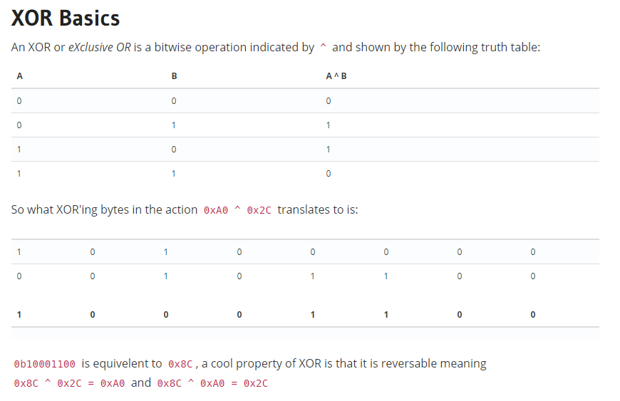

# yeeeeeeet


Write up By
**Robe Zhang** [ThirdRepublic](https://github.com/ThirdRepublic)

## Challenge Description
> i yeeted, you yeeted, he/she/they have yeeten

## Attached Files
- [ciphertext.txt](ciphertext.txt)

## Background Information
 <br />
[Continue Reading](https://ctf101.org/cryptography/what-is-xor/)

## Solution
In order to decrypt the ciphertext, the key has to be found first.  <br />
Knowing that the structure of the flag begins with *flag{*, I wrote a function, findkey which returns the correct single byte key as a chr.
```
def findKey(idx,aChr):
	for x in range(256): # brute forcing the power to Xor
		asciiCode = ord(data[idx]) # Converting to Ascii Code
		asciiChr = chr(asciiCode^x) # Xor and convert back to Ascii Character
		if asciiChr == aChr: 
			print "key[%d] = %s"%(idx,chr(x))
```

```
key[0] = y
key[1] = e
key[2] = e
key[3] = t
key[4] = y
```

With this knowledge, I assumed that the key was *yeet*.  I decrypted the ciphertext using *yeet* as the key.
```
def decode(key):
	output = ""
	keyIdx = 0
	for aChr in data:
		asciiCode = ord(aChr) # Converting to Ascii Code
		asciiChr = chr(asciiCode^ord(key[keyIdx])) # Xor and convert back to Ascii Character
		output += asciiChr
		keyIdx +=1
		if keyIdx >= len(key):
			keyIdx = 0
	print output
```

[yeeeeeeet Script](yeeeeeeet.py)

## Flag
```
flag{yeet_yeet_yeet_yeet_yeet_yeet_yeet_yeet_yeet_yeet_yeet_yeet_yeet_yeet_yeet_yeet_yeet_yeet_yeet_yeet_yeet_yeet_yeet}
```