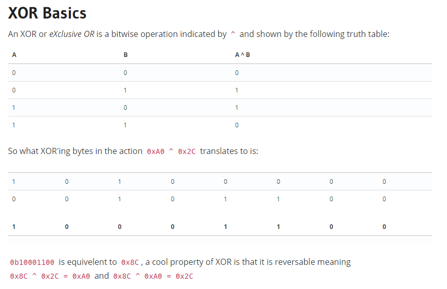

# yeet


Write up By
**Robe Zhang** [ThirdRepublic](https://github.com/ThirdRepublic)

## Challenge Description
> i yeet, you yeet, he/she/they yeet

## Attached Files
- [ciphertext.txt](ciphertext.txt)

## Background Information
 <br />
[Continue Reading](https://ctf101.org/cryptography/what-is-xor/)

## Solution
Here is some python to decrypt the ciphertext using brute force with a single byte key.
```
import base64

data = "HxUYHgIQJgwKHB0mDRYmChgAJgAcHA0mEAsWFxAaGBUVACYbDA0mFxYOJhANCiYbHBoWFBwmCRgLDSYWHyYUACYPFhoYGwwVGAsABA=="
data = base64.b64decode(data)

output = ""

for x in range(256): # brute forcing the power to Xor
	for aChr in data: # looping each char
		ordValue = ord(aChr) # Converting to Ascii Value 
		xor = ordValue^x # Xor
		output += chr(xor) # Convering back to char

	if "flag" in output:
		print x
		print output
	output = ""
```

[yeet Script](yeet.py)

## Flag
```
flag{i_used_to_say_yeet_ironically_but_now_its_become_part_of_my_vocabulary}
```