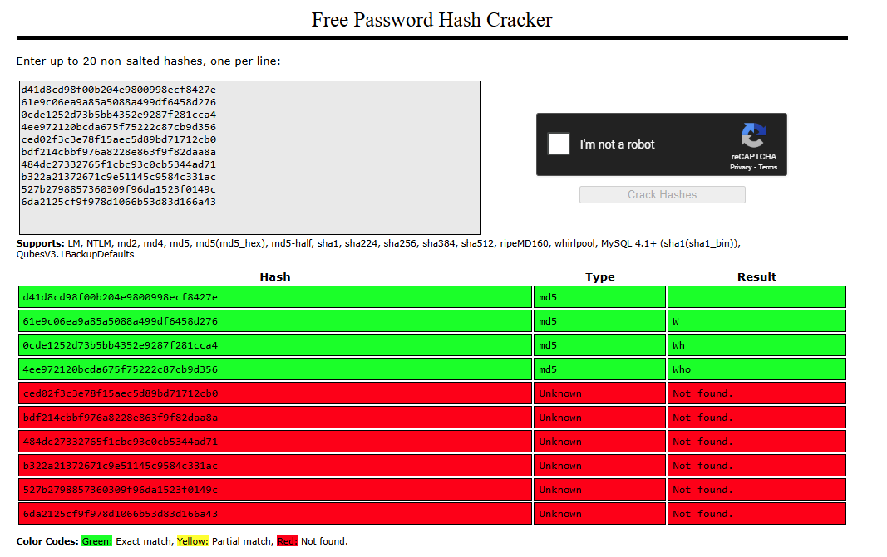
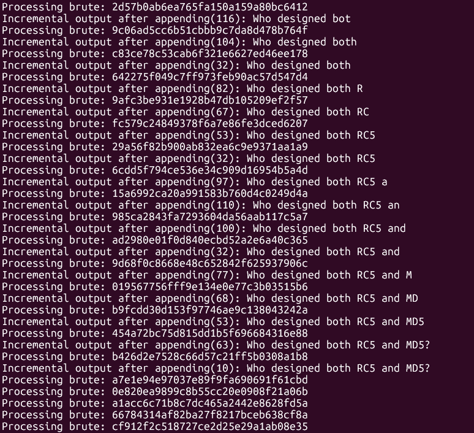

# 01:


## Challenge Description
> Download and solve the puzzle below.

[puzzle.txt](puzzle.txt)

## Background Information
>> A [hash](https://crackstation.net/hashing-security.htm) is an one way [function](https://en.wikipedia.org/wiki/Cryptographic_hash_function) that takes an input and returns a fixed-size string of characters as the output 

### Characteristics of a Hash Function
Deterministic: The same input will always produce the same output.  
Fixed Output Size: No matter if the input is one word or an entire book, the hash value is always the same length  
Pre-image Resistance:
Given a hash value, it's extremely difficult to reverse it to find the original input.  
Collision Resistance: It’s highly unlikely that two different inputs will produce the same hash.  
Avalanche Effect: A tiny change in the input (even one character) should produce a completely different hash.

### Common Usage 
Passwords: Systems store hashed versions of passwords. When you log in, your password is hashed and compared with the stored one.  
File integrity: Downloaded files can be hashed to verify they weren’t tampered with.  
Digital signatures and blockchain: Hashes are essential for verifying data and securing transactions.  

### What is a Unicode Code Point?
> A code point is a number that maps to a specific character in the Unicode standard. It's written like this: U+XXXX, where XXXX is a hexadecimal number

> Unicode has 1,114,112 possible values which ranges from U+0000 to U+10FFFF 

### What is the Unicode code point of an empty string?

> An empty string contains no characters, so it contains no Unicode code point! 

### What are common hash algorithms and how many bits are the checksum?
> https://en.wikipedia.org/wiki/List_of_hash_functions

## Solution

This was a very enjoyable challenge.  It's a puzzle within a puzzle within a puzzle!  And I like solving puzzles!

### Puzzle.txt
[puzzle.txt](puzzle.txt)

Now onto the challenge itself.  Now, what exactly am I looking at and why are there so many lines?   
$ `wc -l ../puzzle.txt`
> 100072 ../puzzle.txt 

$ `head ../puzzle.txt`
```
d41d8cd98f00b204e9800998ecf8427e
61e9c06ea9a85a5088a499df6458d276
0cde1252d73b5bb4352e9287f281cca4
4ee972120bcda675f75222c87cb9d356
ced02f3c3e78f15aec5d89bd71712cb0
bdf214cbbf976a8228e863f9f82daa8a
484dc27332765f1cbc93c0cb5344ad71
b322a21372671c9e51145c9584c331ac
527b2798857360309f96da1523f0149c
6da2125cf9f978d1066b53d83d166a43
```

This looks quite familiar... Where have I seen this before?

Googling the first line yield search results for MD5 hash of an empty string.

What in the world!  Did kyrus-tech encounter a data dump?  Why do they have so many hashes?  Do they realistically want me crack them all?  ***No problem! Let me pull out my cracking rig really right quick /s*** Jokes aside, let's see if there are any common hashes that are precomputed 

Throwing the first 10 lines into [crackstation](https://crackstation.net/) gave the following results: 



MD5 has the following properties for the checksum: 128 bits/16 bytes/32 characters

$ `echo -n "" | openssl dgst -md5`
> MD5(stdin)= d41d8cd98f00b204e9800998ecf8427e

Ah, now that makes more sense.  A quick observation of the results revealed that the hashes are incrementally computed on the input string.  Incrementing the length of a subset of a string.
```
i.e. Input String = "Who EXAMPLE"
line 1: md5sum("")
line 2: md5sum("W")
line 3: md5sum("Wh") 
line 4: md5sum ("Who")
line 5: md5sum ("Who ")
line 6: md5sum ("Who E")
line 7: md5sum ("Who EX")
line 8: md5sum ("Who EXA")
line 9: md5sum ("Who EXAM")
...
```  

One thing to note is the bits of entropy.  Entropy of bits is the amount of randomness in a string (determined by the character set of each individual character in the string). The longer the input string, the more computational effort and resources are required to reproduce the next hash.   
The total entropy is calculated by:   
`Total Entropy = log2(N) x length`  
Where N is the number of unique characters in the character set   
i.e Alpha Numeric : Letters + digits (a–zA–Z0–9) , `N = 62`  
The good thing is that length will always be 1 so the total number of combinations are manageable.  If the length is not restricted, then the number of combinations would exponentially increase as the length increases.

I just need to compute one at a time through all the possibilities for the next character and keep track of all the previously correct characters.   

#### bash script 1
$ `./solver1.sh`  
I have written this logic in [bash](solution/solver1.sh), however the script seems to hang on line 33 `a7e1e94e97037e89f9fa690691f61cbd`  



I have restricted the character set to extended ASCII (0x00 to 0xFF, 255 total characters). `N = 255`  Perhaps the next character is beyond the extended ASCII character set (other languages, emojis, etc). 

#### bash script 2
$ `./solver1_unicode.sh`  
Okay, let's extend the character set to use the entire unicode character set (U+0000 to U+10FFFF, 1,114,112 total characters). `N = 1,114,112`  

A few caveats for the [upgraded bash script with unicode](solution/solver1_unicode.sh):
* There isn't an unicode code point for empty strings.  I need to skip the first hash as the result (md5 of empty string)
* encoding issues for non-printable characters leading to incorrect hash calculations (**unresolved**)  
    * Since I am piping the saved output which includes non-printable characters into md5sum instead of using the raw binary, it is highly likely I am not computing the correct hash for the intended input

I have attempted to solve the encoding issue with `awk` 
```
awk
for code in $(seq 0 114111); do  # U+0000 to U+10FFFF
    awk -v c=$code 'BEGIN { printf "%c", c }'
done
```
The unicode characters do print out correctly to the prompt, however the previously saved unicode in the `CURR` variable is still incorrect.

`test=$(awk -v out=$unicode 'BEGIN { printf "%s%c", $CURR, out }' | md5sum | cut -d ' ' -f 1)`

The script still hangs on line 33 and is not able to handle non-printable unicode characters correctly.  An idea was to append onto `CURR` in a file but having that much I/O seems bad for performance (read, write, and computing the md5sum).  

> Useful command to for future debugging  

$ `echo -n "" | openssl dgst -md5`

This would require some more debugging to resolve...  Let's switch over to python3 instead and put this on the **to do list** to figure out some other time.  

#### python3 solver
[solver.py](solution/solver1.py)  
$ `python3 solver1.py > puzzle2.txt`  

I used ***utf-8*** encoding in python3 `.encode('utf-8')` to resolve the non-printable unicode characters issue.  utf-8 is one way to encode the unicode characters as bytes.  

$ `head puzzle2.txt`
```
Who designed both RC5 and MD5?
da39a3ee5e6b4b0d3255bfef95601890afd80709
e2415cb7f63df0c9de23362326ad3c37a9adfc96
591de29c235c25e331cae90002b1ab114bbc0c2e
30f91050ab65298b4c180debee47189f618ba54e
97211a8888128314d9ca34d1005f08cb83ed5d9c
788fc1f64e4e9da3645b9e659a9ae5df293f05c2
be6b688652aef1a347e497a4e8c021839f50f120
ce67081032fa717dc4112b21b8fdb2c24072b078
90c681956b7af508d95932f0d98139ae35e0d1ba
```

Now would be a good opportunity to ***touch grass***  
Get comfy because `GPU goes BRRRRR...`

After the script finally manages to brute force **100k** hashes, I see:  
:triangular_flag_on_post: `Who designed both RC5 and MD5?`  
and some more hashes...

### Puzzle2.txt
[puzzle2.txt](solution/puzzle2.txt)

Uh oh, here we go again!  
Okay, now there are 2444 hashes now (the first line can be ommited since it is the output flag/question)   
$ `wc -l puzzle2.txt`
> 2441 puzzle2.txt 

This is more manageable

Throwing the first 9 hashes into [crackstation](https://crackstation.net/) yields the following results: 


SHA-1 has the following properties for the checksum: 160 bits/20 bytes/40 characters

$ `echo -n "" | openssl dgst -SHA1`
> SHA1(stdin)= da39a3ee5e6b4b0d3255bfef95601890afd80709

The only changes from the [`solver1.py`](solution/solver1.py) script to the [`solver2.py`](solution/solver2.py) script was to skip the first two lines instead of just the first (accounting for the output flag/question), to change the hash algorithm from MD5 to SHA-1, and to change the input file.  

$ `python3 solver2.py > puzzle3.txt`

$ `head puzzle3.txt`
```
What organization designed SHA-1?
a7ffc6f8bf1ed76651c14756a061d662f580ff4de43b49fa82d80a4b80f8434a
4cea338a15eccf7f51d8297c2873b1c5d0e5bea7d52eb7e984500b0759937d0d
55b180b17e5d63ff8dcdf32870ecf22b0452b825e8c43143e4be2a463a43032f
3951dc5e7e292382ccc6c250b1ce9d647fac541810780a7f28d68af69385cb16
066a58d2d34f520c026be3787b61ba9caa2fa490ae76244cd0e4b826f44233fd
59e9dea4f11bd592c228038b4a93e38155a3f5c2c42ffbb2e3939cca2bd0ecda
d843786d79f254bd8e0733b44fa6367fa95c7616e62379f4a3c1a3288cd82dcc
ceb5ee70460cb2adbe0c3d2733ae53d940ebd65facb44e0f7a24762212bd486a
85b778be9cc6c29f697c2a5f7683a0bc04f75e7595cffb4ca916e3fb5f9b0a61
```
There is another output flag/question:   
:triangular_flag_on_post: `What organization designed SHA-1?`  
and some more hashes... 

### Puzzle3.txt
[puzzle3.txt](solution/puzzle3.txt)

Third time's the charm, right?   
Okay, now there 37 hashes now (the first line can be ommited since it is the output flag/question and there is a newline at the end)   
$ `wc -l puzzle3.txt`
> 39 puzzle3.txt 

Throwing the first 9 hashes into [crackstation](https://crackstation.net/) gave the following results: 


Hmm... There are no hits at all...

The hashes are 64 characters long (256 bits/32 bytes/64 characters)  
Perhaps crackstation hasn't computed or have support for this hash algorithm   

Following the pattern from the first two puzzles, I suspect the first hash is for an empty string

Let's manually calculate it:   
$ `echo -n "" | openssl dgst -SHA-256`
> SHA2-256(stdin)= e3b0c44298fc1c149afbf4c8996fb92427ae41e4649b934ca495991b7852b855

Wait a second, did I miss out on an attack on SHA-256?  
> Nope.  

Okay, so it definitely is not using SHA-256 as the hashing algorithm.  

What other 256 bits hashing algorithms are there? 
> After some [researching](https://en.wikipedia.org/wiki/Secure_Hash_Algorithms), SHA-512/256, SHA3-256, BLAKE2b, SM3, and GOST are possibilities to attempt

$ `echo -n "" | openssl dgst -SHA-512`
> SHA2-512(stdin)= cf83e1357eefb8bdf1542850d66d8007d620e4050b5715dc83f4a921d36ce9ce47d0d13c5d85f2b0ff8318d2877eec2f63b931bd47417a81a538327af927da3e

Note: this would need to be truncated to 256 bits as follows:
$ `echo -n "" | openssl dgst -SHA-512 | cut -d "=" -f2 | tr -d '\n' | tr -
d ' ' | cut -c1-64`
> cf83e1357eefb8bdf1542850d66d8007d620e4050b5715dc83f4a921d36ce9ce

$ `echo -n "" | openssl dgst -SHA3-256`
> SHA3-256(stdin)= a7ffc6f8bf1ed76651c14756a061d662f580ff4de43b49fa82d80a4b80f8434a

$ `echo -n "" | openssl dgst -blake2s256`
> BLAKE2S-256(stdin)= 69217a3079908094e11121d042354a7c1f55b6482ca1a51e1b250dfd1ed0eef9

$ `echo -n "" | openssl dgst -sm3`
> SM3(stdin)= 1ab21d8355cfa17f8e61194831e81a8f22bec8c728fefb747ed035eb5082aa2b

`GOST` is not a part of openssl and was not attempted since the correct hash algorithm was already detected.  

It's using the **SHA3-256 algorithm**!

The only changes from the [`solver2.py`](solution/solver2.py) script to the [`solver3.py`](solution/solver3.py) script was to change the hash algorithm from SHA-1 to SHA3-256, and the input file

$ `python3 solver3.py`  
:triangular_flag_on_post: `Who co-developed both AES and SHA-3?`

That's all! No more puzzles.  

## Flag
`Who designed both RC5 and MD5?`
> Ronald Linn Rivest  

`What organization designed SHA-1?`
> National Security Agency

`Who co-developed both AES and SHA-3?`
> Joan Daemen