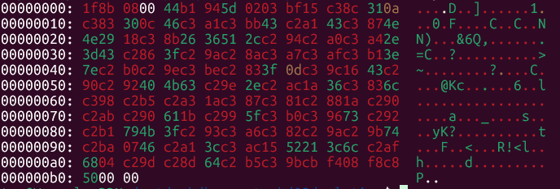

# 02:


## Challenge Description
```
Solve:
789c0dccdb5283301405d04f82412ee9231c0ae8214de8ddbe594781888549dad
9c8d7dbf501ab125c539aad612b1a0a9f90882342cce4542ed3b9445ce50f5fd3
78d079e7478ab726efffde83c36ea141728bb879e883a6ce78f4eb98117fe756a
859df127292bf9024d42e628308a7467083e92ddd059a6e7d42361b03841b87c8
d0fd934de95485b0a23eb3f423d962caba52f0e52c14105d164c35b9f3506bc17
bc4d7bc75fc81e9eec38ed5d671a7a572c5f1b5d3e5423668d7985ec89cf6cf5b
5d61571e92558ad12323b9489ffe013c525446
```

## Background Information
*  [File Signatures](https://www.garykessler.net/library/file_sigs_GCK_latest.html)
*  [binwalk](hhttps://github.com/ReFirmLabs/binwalk/wiki/File-Analysis-and-Extraction)
***
* [zlib RFC](https://www.rfc-editor.org/rfc/rfc1950.html)
* [zlib](https://www.euccas.me/zlib/)
* [wbits](https://docs.python.org/3/library/zlib.html)
```
The wbits argument controls the size of the history buffer (or the “window size”) used when compressing data, and whether a header and trailer is included in the output. It can take several ranges of values, defaulting to 15 (MAX_WBITS):

    +9 to +15: The base-two logarithm of the window size, which therefore ranges between 512 and 32768. Larger values produce better compression at the expense of greater memory usage. The resulting output will include a Zlib-specific header and trailer.

    −9 to −15: Uses the absolute value of wbits as the window size logarithm, while producing a raw output stream with no header or trailing checksum.

    +25 to +31 = 16 + (9 to 15): Uses the low 4 bits of the value as the window size logarithm, while including a basic Gzip header and trailing checksum in the output.
```

```
python3 -c "  
import zlib  
with open('FILE.txt', 'rb') as f:  
    compressedBytes = f.read()  
print(zlib.decompress(compressedBytes, wbits=XXXX))"  
```

```
-zlib.MAX_WBITS       	Raw zlib stream              [-15]
zlib.MAX_WBITS       	Zlib stream with headers     [ 15]
16 + zlib.MAX_WBITS   	Gzip-compressed data         [ 31]
```
***
* [gzip File Format RFC](https://www.rfc-editor.org/rfc/rfc1952.html)
* [Gzip File Format Dissected](https://commandlinefanatic.com/cgi-bin/showarticle.cgi?article=art053)
* [Gzip Recovery Toolkit used for debugging](https://github.com/arenn/gzrt)

***

* [DEFLATE](https://zlib.net/feldspar.html)

***


### Other Resources Worth Reading

* [DEFLATE Related Writeup](https://blog.badat.dev/futuredisk-writeup/) 
* [Multiple Encoding Writeup](https://mcdulltii.github.io/ctf%20writeups/2020/08/28/TISC20-Writeups.html)
* [Repo for DEFLATE](https://github.com/stokito/deflate)
* [Repo for playing around with DEFLATE](https://github.com/nayuki/Simple-DEFLATE-decompressor/tree/85b6992b7e41e4ef6e7d4ee96ea0d61a05d676b3)
* [Gzip Recovery Guidance from Jean-loup Gailly](https://web.archive.org/web/20180708075208/http://www.gzip.org/recover.txt)


## Solution

### Zlib

My initial thoughts were to concatenate all the hex strings into a single continuous hex stream instead of having multiple lines of hex delimited by the line feed `/n`.  I suspect that I was given a file of some sort but in a hex string format with my first objective of reassembling the file into its original format. 

I converted the single continuous hex stream back into a binary format using `xxd`.  
$ `cat ../challenge.txt | tr -d '\n' | xxd -r -p > challenge.bin`

Now that we have a binary, let's see what file we are dealing with!  
$ `binwalk challenge.bin`
```

DECIMAL       HEXADECIMAL     DESCRIPTION
--------------------------------------------------------------------------------
0             0x0             Zlib compressed data, default compression

```
That is good. binwalk detected that the binary is compressed with the `Zlib file format`.  

Let's use binwalk to extract it recursively.

Note: binwalk uses python's built-in Zlib module for handling Zlib-compressed data

$ `binwalk -Me challenge.bin`
```
Target File:   02/solution/challenge.bin
MD5 Checksum:  c8d582f6adb6605f06afae311949d6b0
Signatures:    411

DECIMAL       HEXADECIMAL     DESCRIPTION
--------------------------------------------------------------------------------
0             0x0             Zlib compressed data, default compression


Target File:   02/solution/_challenge.bin.extracted/0
MD5 Checksum:  c3991e48abf0bafb4c7198c61e5ce108
Signatures:    411

DECIMAL       HEXADECIMAL     DESCRIPTION
--------------------------------------------------------------------------------
```

$ `cat _challenge.bin.extracted/0`
> H8KLCABEwrHClF0Cw78Vw4wxCsODMAxGw6HDu0PCoUPDh05OKRjDiyY2USzClMKgw6QuPUPChj/CmsKKw6fDr8OxPn7CsMKew77Cgz8Nw5wWQ8KQwpJAS2PCni7CrBo2w4Nsw5jCtcKjGsOHw4HCiBrCkMKrwpBhG8KZX8Oww5ZzwpLCsXlLP8KTw6bDgsKawpt0wroHRsKhPMOsFVIhPGzCr2gEwp3CjWTCtcObwr9/w79Awo/CjMKFAAAA

This is what was extracted from `challenge.bin`

$ `cat _challenge.bin.extracted/0.zlib`
```
��R�0�O�A.�#
�!M�ݾYG���I�������\S��a+␦
���#B��T.ӹD\�_�x�y�G��&��ރ�n�Ar��y胦�x���V�Y�r���$�.b�Fp��-��n}B6����M�T���>��#�bʺR��,]L5��Pk�{�׼u����Î��q��r����B6hט^Ȝ��[]aW�U��##�H��<RTF
```

This is the contents of `challenge.bin`

$ `cp _challenge.bin.extracted/0 challenge_zlib.decompress`

I am only interested in the file `challenge_zlib.decompress` that is extracted from `challenge.bin`

***

Here are some alternative methods to extract the compressed Zlib:

Note: Since it is valid `Zlib file format` with the header and checksum, zlib-flate can also be used  

$ `zlib-flate -uncompress < challenge.bin > challenge_zlib.decompress`  
> H8KLCABEwrHClF0Cw78Vw4wxCsODMAxGw6HDu0PCoUPDh05OKRjDiyY2USzClMKgw6QuPUPChj/CmsKKw6fDr8OxPn7CsMKew77Cgz8Nw5wWQ8KQwpJAS2PCni7CrBo2w4Nsw5jCtcKjGsOHw4HCiBrCkMKrwpBhG8KZX8Oww5ZzwpLCsXlLP8KTw6bDgsKawpt0wroHRsKhPMOsFVIhPGzCr2gEwp3CjWTCtcObwr9/w79Awo/CjMKFAAAA

Note: `gzip` can also be used with some caveats.  Gzip indirectly calls the DEFLATE algorithm implemented by Python's Zlib module.  It requires a valid `Gzip file format` header.  The footer is optional since DEFLATE algorithm compresses/decompresses data sequentially, one chunk at a time.  
$ `printf "\\x1f\\x8b\\x08\\x00\\x00\\x00\\x00\\x00" | cat - challenge.bin | gzip -dc > challenge_zlib.decompress`
> H8KLCABEwrHClF0Cw78Vw4wxCsODMAxGw6HDu0PCoUPDh05OKRjDiyY2USzClMKgw6QuPUPChj/CmsKKw6fDr8OxPn7CsMKew77Cgz8Nw5wWQ8KQwpJAS2PCni7CrBo2w4Nsw5jCtcKjGsOHw4HCiBrCkMKrwpBhG8KZX8Oww5ZzwpLCsXlLP8KTw6bDgsKawpt0wroHRsKhPMOsFVIhPGzCr2gEwp3CjWTCtcObwr9/w79Awo/CjMKFAAAA

Regardless of the method used, the decompressed output is most likely base64 encoded.

### base64

$ `cat challenge_zlib.decompress` 
`H8KLCABEwrHClF0Cw78Vw4wxCsODMAxGw6HDu0PCoUPDh05OKRjDiyY2USzClMKgw6QuPUPChj/CmsKKw6fDr8OxPn7CsMKew77Cgz8Nw5wWQ8KQwpJAS2PCni7CrBo2w4Nsw5jCtcKjGsOHw4HCiBrCkMKrwpBhG8KZX8Oww5ZzwpLCsXlLP8KTw6bDgsKawpt0wroHRsKhPMOsFVIhPGzCr2gEwp3CjWTCtcObwr9/w79Awo/CjMKFAAAA`

Decoding it yields:  
$ `base64 -d challenge_zlib.decompress`
```
D±]ÿÌ1
Ã0                                   dµÛ¿ÿ@
```

That is not really a useful output...

Let's check what file format we have now!  First, write it to a file:   
$ `base64 -d challenge_zlib.decompress > challenge_base64.decoded`  

$ `binwalk challenge_base64.decoded`  
```

DECIMAL       HEXADECIMAL     DESCRIPTION
--------------------------------------------------------------------------------

```

$ `file challenge_base64.decoded`  
> challenge_base64.decoded: data

Hmm... neither `binwalk` or `file` was able to determine the file format.  Let's take a closer look at the bytes for any additional clues  

$ `cat -A challenge_base64.decoded`
```
^_M-BM-^K^H^@DM-BM-1M-BM-^T]^BM-CM-?^UM-CM-^L1$
M-CM-^C0^LFM-CM-!M-CM-;CM-BM-!CM-CM-^GNN)^XM-CM-^K&6Q,M-BM-^TM-BM- M-CM-$.=CM-BM-^F?M-BM-^ZM-BM-^JM-CM-'M-CM-/M-CM-1>~M-BM-0M-BM-^^M-CM->M-BM-^C?^MM-CM-^\^VCM-BM-^PM-BM-^R@KcM-BM-^^.M-BM-,^Z6M-CM-^ClM-CM-^XM-BM-5M-BM-#^ZM-CM-^GM-CM-^AM-BM-^H^ZM-BM-^PM-BM-+M-BM-^Pa^[M-BM-^Y_M-CM-0M-CM-^VsM-BM-^RM-BM-1yK?M-BM-^SM-CM-&M-CM-^BM-BM-^ZM-BM-^[tM-BM-:^GFM-BM-!<M-CM-,^UR!<lM-BM-/h^DM-BM-^]M-BM-^MdM-BM-5M-CM-^[M-BM-?^?M-CM-?@M-BM-^OM-BM-^LM-BM-^E^@^@^@
```

$ `xxd challenge_base64.decoded`  


### Gzip

The [file signature](https://www.garykessler.net/library/file_sigs_GCK_latest.html) of challenge_base64.decoded matches closely to that of the `Gzip file format` ***0x1F 0x8B 0x08***

The `Gzip file format` is essentially a wrapper around the DEFLATE compression algorithm, with some added metadata (10 bytes header + additional bytes for the set flags + 8 bytes footer)  

Note: The `Gzip file format` and ***gzip/gunzip*** are different.  The former is a the data format and the latter is a linux binary used for compression/decompression the `Gzip file format`.   

Let's try decompressing it anyways with `gzip`  

$ `man gzip`
```
       -c --stdout --to-stdout
              Write output on standard output; keep original files unchanged.  If there are several input files, the  out‐
              put  consists  of  a sequence of independently compressed members. To obtain better compression, concatenate
              all input files before compressing them.

       -d --decompress --uncompress
              Decompress.

       -v --verbose
              Verbose. Display the name and percentage reduction for each file compressed or decompressed.
```

$ `gzip -cdv challenge_base64.decoded`  
> gzip: challenge_base64.decoded: not in gzip format

Nope! `gzip` isn't playing ball.  `gzip` doesn't like the file being provided.

One caveat is: GNU Gzip does not support the `--ignore-crc` option; therefore it strictly checks the CRC and refuses to decompress files with checksum errors.

#### What are some other methods to interact with a `Gzip file format`? 

The `Gzip file format` is a stream-based format, so partial recovery is sometimes possible with  
$ `dd if=challenge_base64.decoded bs=1 count=5 | gzip -cdv`  
```
5+0 records in
5+0 records out
5 bytes copied, 9.9992e-05 s, 50.0 kB/s

gzip: stdin: not in gzip format
```

Hmm, it seems like the gzip-compressed file is corrupted even when attempting to recover 5 bytes.  

*** 

`zcat` decompresses a .gz file and outputs the contents to stdout, just like cat does for regular files.

$ `zcat challenge_base64.decoded`  
> gzip: challenge_base64.decoded: not in gzip format

This also doesn't work, `zcat` uses `Zlib` internally which runs into the same issues with `gzip`.  

***

`zless` is used to view the contents of a .gzip file without needing to decompress the file manually.

$ `zless challenge_base64.decoded`  
```
^_<U+008B>^H^@D±<U+0094>]^Bÿ^UÌ1
Ã0^LFáûC¡CÇNN)^XË&6Q,<U+0094> ä.=C<U+0086>?<U+009A><U+008A>çïñ>~°<U+009E>þ<U+0083>?^MÜ^VC<U+0090><U+0092>@Kc<U+009E>.¬^Z6Ãlص£^ZÇÁ<U+0088>^Z<U+0090>«<U+0090>aESC<U+0099>_ðÖs<U+0092>±yK?<U+0093>æÂ<U+009A><U+009B>tº^GF¡<ì^UR!<l¯h^D<U+009D><U+008D>dµÛ¿^?ÿ@<U+008F><U+008C><U+0085>^@^@^@
challenge_base64.decoded (END)
```

Looks like the Unicode code point is making another appearance!  There are quite a few Unicode characters.  Are they supposed to be there?

***

`gzrt (gzrecover)` is a recovery tool for gzip-compressed (.gz) files. It attempts to recover usable data from corrupted or partially downloaded Gzip files by scanning for valid DEFLATE streams and decompressing what it can.

$ `man gzrecover`  
```
       -v
              Turn on verbose mode.
       -p
              Write recovered data to stdout instead of file.
```
`gzrecover -vp challenge_base64.decoded`  
> Opened input file for reading: challenge_base64.decoded  
> Total decompressed output = 0 bytes  

Hmm.. still no dice.

#### Stream Recovery/Patching Planning

Okay, let's get the file back into a valid `Gzip file format` since all the tools are complaining about the file format.  

Let's create a example `Gzip file format` to reference  

$ `echo "Hello World\n" > exampleWorld.txt`  

$ `gzip exampleWorld.txt`  

$ `xxd exampleWorld.txt.gz`  


$ `zless exampleWorld.txt.gz`   
```
Hello World\n
hello.txt.gz (END)
```

$ `file exampleWorld.txt.gz`  
> exampleWorld.txt.gz: gzip compressed data, was "exampleWorld.txt", last modified: Thu Jun 26 20:42:56 2025, from Unix, original size modulo 2^32 14

$ `gzrecover -vp exampleWorld.txt.gz`  
```
Opened input file for reading: exampleWorld.txt.gz
Hello World\n
Found error at byte 47 in input stream
Found good data at byte 0 in input stream
Total decompressed output = 14 bytes
```

Let's focus on the `Gzip file format` header and the `Gzip file format` footer. 

```
Header
1 byte	GZIP file format identifier. Must be 0x1F 0x8B
1 byte	^
1 byte	Compression Method	0x08 = DEFLATE
1 byte	Flags
4 bytes	MTIME	Time the file was last modified. Encoded (in little-endian) as seconds since the UNIX epoch
1 byte	Deflate-specific flags
1 byte	Filesystem on which compression occurred.

Footer
4 bytes  CRC32 of the uncompressed data. Encoded as little-endian
4 bytes  Size (in bytes) of the uncompressed data modulo 2^32. Encoded as little-endian.     
```

$ `xxd challenge_base64.decoded`  


Currently, challenge_base64.decoded has the following  `Gzip file format` header: 

>  1f c2       => Not Valid Magic Bytes  
>  8b          => Not Valid Compression Method  
>  08          => FNAME Flag - Original filename present (null-terminated)   
>  00 44 c2 b1 => 0xb1c24400 => 2064-06-21 00:41:04 UTC  
>  c2          => Not Valid Deflate-specific flags
>  94          => Not Valid Filesystem

And the  `Gzip file format` footer: 
> 8f c2 8c c2 => CRC32 of uncompressed data (c28cc28f)  
> 85 00 00 00 => 0x00000085 => size of 133 bytes uncompressed 

Most of this data is nonsense

***

Let's fix them by removing the 2nd, 7th, 10th, and 12th bytes **0xc2**  
And replace the 13th byte **0xc3** with **0x03**

Let's also remove 5th, 7th, and 9th to last bytes  

`Gzip file format` header: 
> header: 1f8b 0800 44b1 945d 0203    
>  1f 8b       => Valid Magic Bytes  
>  08          => DEFLATE Compression Method  
>  00          => No Flag     
>  44 b1 94 5d => 0x5d94b144 => 2019-09-30 04:09:24 UTC  
>  02          => 2: Best compression
>  03          => 3: Unix 

`Gzip file format` footer: 
> footer: bf40 8f8c 8500 0000  
> bf 40 8f 8c => CRC32 of uncompressed data (8c8f40bf)  
> 85 00 00 00 => 0x00000085 => size of 133 bytes uncompressed 

Much better!  Now the `Gzip file format` header and `Gzip file format` footer are valid.

#### Patch 1

Here were the commands used for patching:   
$ `xxd -p challenge_base64.decoded | tr -d "\n" > tmp.hexdump`  

Manually patch the hexdump in a text editor or the following replacement sed commands:   
$ `sed -i 's/1fc28b080044c2b1c2945d02c3/1f8b080044b1945d0203/g' tmp.hexdump`  

$ `sed -i 's/2bf7fc3bf40c28fc28cc285000000/bf408f8c85000000/g' tmp.hexdump`

Convert the hexdump into binary  
$ `xxd -r -p tmp.hexdump > patchedHeaderFooter.gz`

$ `md5sum patchedHeaderFooter.gz`  
> a615137d83d6fe62561810c5b1f4d768  patchedHeaderFooter.gz

$ `xxd patchedHeaderFooter.gz`  
  

$ `file patchedHeaderFooter.gz`
>  patchedHeaderFooter.gz: gzip compressed data, last modified: Wed Oct  2 14:16:36 2019, max compression, from Unix, original size modulo 2^32 20680

Nice! Now the `Gzip file format` header is printing similar to the that of `exampleWorld.txt.gz`

$ `zless patchedHeaderFooter.gz`
```
^_<8B>^H^@D<B1><94>]^B^C<BF>^UÌ1
Ã0^LFáûC¡CÇNN)^XË&6Q,<U+0094> ä.=C<U+0086>?<U+009A><U+008A>çïñ>~°<U+009E>þ<U+0083>?^MÜ^VC<U+<U+0090><U+0092>@Kc<U+009E>.¬^Z6Ãlص£^ZÇÁ<U+0088>^Z<U+0090>«<U+0090>aESC<U+0099>_ðÖs<U+0092>±yK?<U+0093>æÂ<U+009A><U+009B>tº^GF¡<ì^UR!<l¯h^D<U+009D><U+008D>dµÛ<CB><F4>^H<F8><C8>P^@^@
patchedHeaderFooter.gz (END)
```

Looks like some other Unicode code point are still there.  Let's remove them in the next patch!

```
:%s/c294/94/g
:%s/c286/86/g
:%s/c29A/9A/g
:%s/c28A/8A/g
:%s/c29E/9E/g
:%s/c288/88/g
:%s/c290/90/g
:%s/c299/99/g
:%s/c292/92/g
:%s/c293/93/g
:%s/c29B/9B/g
:%s/c28D/8D/g
```

$ `gzrecover -vp patchedHeaderFooter.gz`
```
Opened input file for reading: patchedHeaderFooter.gz
Found error at byte 11 in input stream
Found good data at byte 0 in input stream
iHP�pTotal decompressed output = 6 bytes
```
Nice, 6 bytes were able to be recovered! That is better than the initial 0 bytes.  

#### Patch 2

$ `xxd -p patchedHeaderFooter.gz | tr -d "\n" > tmp.hexdump`

Let's make those other Unicode code point patches
```
sed -i 's/c294/94/g ' tmp.hexdump
sed -i 's/c286/86/g ' tmp.hexdump
sed -i 's/c29A/9A/g ' tmp.hexdump
sed -i 's/c28A/8A/g ' tmp.hexdump
sed -i 's/c29E/9E/g ' tmp.hexdump
sed -i 's/c288/88/g ' tmp.hexdump
sed -i 's/c290/90/g ' tmp.hexdump
sed -i 's/c299/99/g ' tmp.hexdump
sed -i 's/c292/92/g ' tmp.hexdump
sed -i 's/c293/93/g ' tmp.hexdump
sed -i 's/c29B/9B/g ' tmp.hexdump
sed -i 's/c28D/8D/g ' tmp.hexdump
```

Convert the hexdump into binary  
$ `xxd -r -p tmp.hexdump > patchedUnicodeHeaderFooter.gz`

$ `md5sum patchedUnicodeHeaderFooter.gz`  
> 33457d309ef5ac645a8a211379dfc606  patchedUnicodeHeaderFooter.gz

$ `xxd patchedUnicodeHeaderFooter.gz`  


$ `file patchedUnicodeHeaderFooter.gz`
>  patchedUnicodeHeaderFooter.gz: gzip compressed data, last modified: Wed Oct  2 14:16:36 2019, max compression, from Unix, original size modulo 2^32 20680

$ `zless patchedUnicodeHeaderFooter.gz`
```
^_<8B>^H^@D<B1><94>]^B^C<BF>^UÌ1
Ã0^LFáûC¡CÇNN)^XË&6Q,<94> ä.=C<86>?<U+009A><U+008A>çïñ>~°<U+009E>þ<U+0083>?^MÜ^VC<90><92>@Kc<U+009E>.¬^Z6Ãlص£^ZÇÁ<88>^Z<90>«<90>aESC<99>_ðÖs<92>±yK?<93>æÂ<U+009A><U+009B>tº^GF¡<ì^UR!<l¯h^D<U+009D><U+008D>dµÛ<CB><F4>^H<F8><C8>P^@^@
(END)
```

Whoops! It looks like there are more Unicode code point to remove!

```
:%s/c29A/9A/g
:%s/c28A/8A/g
:%s/c29E/9E/g
:%s/c283/83/g
:%s/c29B/9B/g
:%s/c29D/9D/g
:%s/c28D/8D/g
```

$ `gzrecover -vp patchedUnicodeHeaderFooter.gz`
```
Opened input file for reading: patchedUnicodeHeaderFooter.gz
Found error at byte 11 in input stream
Found good data at byte 0 in input stream
iHP�pTotal decompressed output = 6 bytes
```
No change in the number of bytes successfully extract! 

#### Patch 3

$ `xxd -p patchedUnicodeHeaderFooter.gz | tr -d "\n" > tmp.hexdump`

Let's make those other Unicode code point patches
```
sed -i 's/c294/94/g ' tmp.hexdump
sed -i 's/c286/86/g ' tmp.hexdump
sed -i 's/c29A/9A/g ' tmp.hexdump
sed -i 's/c28A/8A/g ' tmp.hexdump
sed -i 's/c29E/9E/g ' tmp.hexdump
sed -i 's/c288/88/g ' tmp.hexdump
sed -i 's/c290/90/g ' tmp.hexdump
sed -i 's/c299/99/g ' tmp.hexdump
sed -i 's/c292/92/g ' tmp.hexdump
sed -i 's/c293/93/g ' tmp.hexdump
sed -i 's/c29B/9B/g ' tmp.hexdump
sed -i 's/c28D/8D/g ' tmp.hexdump
```

Convert the hexdump into binary  
$ `xxd -r -p tmp.hexdump > patched3UnicodeHeaderFooter.gz`

$ `md5sum patched3UnicodeHeaderFooter.gz`  
> 33457d309ef5ac645a8a211379dfc606  patchedUnicodeHeaderFooter.gz

Wait, this is the same hash as the second patch? Something isn't right...  
Let's backtrack!

So far, I know that some Unicode code point characters are corrupting the `Gzip file format`  

***If it looks like a duck, swims like a duck, and quacks like a duck, then it probably is a duck***

I'm sure its a `Gzip file format`, but corrupted somehow...

Google has some insight on why this may be the case: 
```
Illegal UTF-8 Sequences
UTF-8 corruption - Binary data gets interpreted as UTF-8 which breaks the Gzip file format

To cause the UTF-8 corruption:

1	Gzip → bytes	              original compressed content
2	bytes → Latin-1 str	       first encoding preserves bytes
3	Latin-1 str → UTF-8 bytes	second encoding causes corruption

To reverse the UTF-8 corruption:

1	UTF-8 bytes → decode UTF-8 	   Decode	
2	encode Latin-1                 Encode
2	Gzip decompress	          Reveals true data
```  

Note:  Use latin1 (ISO-8859-1) decoding.  
It will never fail since it maps bytes 1:1  

### Reverse the UTF-8 Corruption

Python3 script to reverse the UTF-8 corruption  
$ [`python3 reverseUTF8Corruption.py`](solution/reverseUTF8Corruption.py)

$ `file challenge_gzip.fixed`  
> challenge_gzip.fixed: gzip compressed data, last modified: Wed Oct  2 14:16:36 2019, max compression, original size modulo 2^32 133  

Test if the `Gzip file format` is truly fixed  
$ `gzip -tv challenge_gzip.fixed`
> challenge_gzip.fixed:    OK

Let's review the output of a valid `Gzip file format` so next time I can quickly recognize the corruption  
$ `zless challenge_gzip.fixed`
```
<A3>�����<FA><E2><F8><FA><8F><BD>���������������<B4><A2><F4>�����<BD><F8><AF><BD><F8><BB><B9><B6>�����<F8><A1><B7><AD><F8><A8><B9><A1>�����<BD>�����<A2><FA><F<F4><F8>�����<B7><FA><E2><F8>�����<AA><B9><AC><AD><B4><B9><AC><B1><B7><B6><AB><F9><FA><F4><F8>�����<FA><E2><F8>�����<AB>�����<F8><B1><AB>�����<B7><B5><BD><F9><FA><A5>
challenge_gzip.fixed (END)
```

$ `gzrecover -vp challenge_gzip.fixed`  
```
Opened input file for reading: challenge_gzip.fixed
�������������������������������������������������������������������������������������������������������������������������������������Found error at byte 123 in input stream
Found good data at byte 0 in input stream
Total decompressed output = 133 bytes
```

$ `md5sum challenge_gzip.fixed`
> f4b0908dd75c6a19c150bbdffa25451a  challenge_gzip.fixed

Let's finally decompress it  
$ `gzip -dkc challenge_gzip.fixed > challenge_gzip.decompress`

$ `md5sum challenge_gzip.decompress`
> d457fbfbf87e1dfc91d7f05bf72dad44  challenge_gzip.decompress

$ `file challenge_gzip.decompress`   
> challenge_gzip.decompress: Non-ISO extended-ASCII text, with no line terminators

$ `binwalk challenge_gzip.decompress`  
```

DECIMAL       HEXADECIMAL     DESCRIPTION
--------------------------------------------------------------------------------

```

$ `xxd challenge_gzip.decompress`  


$ `strings challenge_gzip.decompress`
> 

Hmm... this doesn't match a known file format.  

#### iconv Approach

$ `man iconv`
```
       --from-code=from-encoding
       -f from-encoding
              Use from-encoding for input characters.

       --to-code=to-encoding
       -t to-encoding
              Use to-encoding for output characters.

              If the string //IGNORE is appended to to-encoding, characters  that  cannot
              be converted are discarded and an error is printed after conversion.

              If  the string //TRANSLIT is appended to to-encoding, characters being con‐
              verted are transliterated when needed and possible.  This means that when a
              character cannot be represented in the target character set, it can be  ap‐
              proximated  through  one or several similar looking characters.  Characters
              that are outside of the target character set and cannot  be  transliterated
              are replaced with a question mark (?) in the output.
```

Using iconv from UTF-8 to LATIN1

$ `cat challenge_zlib.decompress | base64 -d | iconv -f UTF-8 -t LATIN1 | gzip -dkc > challenge_gzip.decompress`

$ `md5sum challenge_gzip.decompress`
> d457fbfbf87e1dfc91d7f05bf72dad44  challenge_gzip.decompress

Good, the same checksum!

## Mystery Binary 

Brute forcing a single byte XOR reveals a flag!  
[python3 xor.py](solution/xor.py)
```
216  :  {"flag": "We like your skillz, maybe we can help you pay those billz", "intro": "Congratulations!", "post": "Kyrus Tech is awesome!"}

248  :  [FLAG␦wELIKEYOURSKILLZ
                              MAYBEWECANHELPYOUPAYTHOSEBILLZ
                                                            INTRO␦cONGRATULATIONS
```

## Flag

### Challenge Format Progression  
Lots of encoding/decoding involved  
* challenge.txt (hexdump)  
* challenge.bin (Zlib file format)  
* challenge_zlib.decompress (base64)  
* challenge_base64.decoded (corrupted Gzip) 
* challenge_gzip.fixed (Gzip)
* challenge_gzip.decompress (XORed Binary)

`{"flag": "We like your skillz, maybe we can help you pay those billz", "intro": "Congratulations!", "post": "Kyrus Tech is awesome!"}`