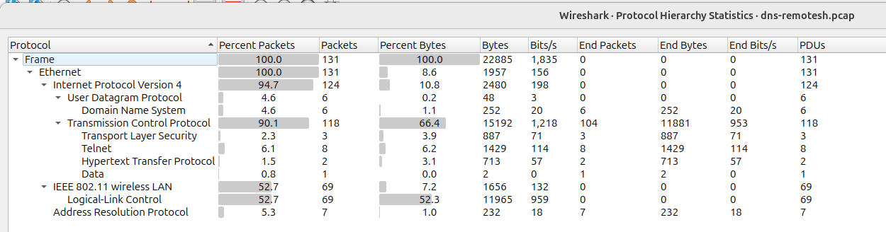
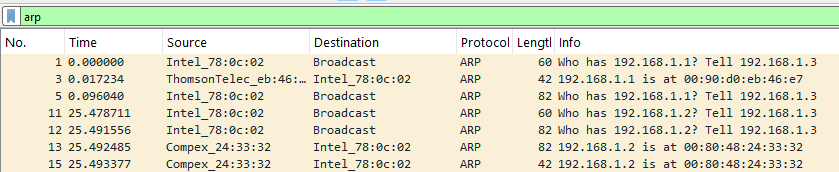

# 03:


## Where is Challenge 03?

While observing the challenge page, something was off.  Each challenge had the structure of the challenge number `##:` followed by a `hr`
***
Something is definitely fishy here.  There appears to be a miscount in the labelling for the challenges or a challenge was removed.  Has anyone seen Challenge 03?  
I investigated further by going through the page source and found Challenge 03  
Challenge 03 was hidden with its `style=visibility:hidden`


Oh, the challenge is in the webpage source 

## Challenge Description
> \<div class="puzzle_03" style="visibility:hidden">{"find_flag":"aHR0cHM6Ly93d3cua3lydXMtdGVjaC5jb20vcy9kbnMtcmVtb3Rlc2gucGNhcA=="}</> div>


## Background Information
>> N/A

## Solution

First, we need to decode the base64 encoding:  
$ `echo "aHR0cHM6Ly93d3cua3lydXMtdGVjaC5jb20vcy9kbnMtcmVtb3Rlc2gucGNhcA==" | base64 --d`
> https://www.kyrus-tech.com/s/dns-remotesh.pcap  

Let's see what we are actually getting  
Note:   
-I: Fetch only the HTTP headers using a HEAD request  
-L: Follow redirects (like 301 or 302) automatically  
 
$ `curl -IL https://www.kyrus-tech.com/s/dns-remotesh.pcap`
```
HTTP/2 302
age: 0
content-type: application/octet-stream
date: Sun, 22 Jun 2025 21:40:16 GMT
etag: W/"062c98d6ced7e65a4e54c490383506c7"
expires: Thu, 01 Jan 1970 00:00:00 GMT
location: https://static1.squarespace.com/static/5c2a46b65cfd792a15793311/t/6580b6c6c4ffb1557722ada8/1702934214985/dns-remotesh.pcap
server: Squarespace
set-cookie: crumb=BZIkWXb7JPF6NzAzYWNkMDVmNDM5MzlhNGU2MmUyMWQzMWNhMjc5;Secure;Path=/
strict-transport-security: max-age=0
x-content-type-options: nosniff
x-contextid: D1xD6Owp/bJWxj1C3
content-length: 0

HTTP/2 200
cache-control: public, max-age=94608000
content-disposition: attachment; filename="dns-remotesh.pcap"; filename*=UTF-8''dns-remotesh.pcap
content-type: application/vnd.tcpdump.pcap
pragma: cache
server: Squarespace
timing-allow-origin: *
x-content-type-options: nosniff
x-contextid: JAIdb4RA/ViKZEA4s
via: 1.1 varnish, 1.1 varnish
accept-ranges: bytes
age: 15374
date: Mon, 23 Jun 2025 02:00:23 GMT
x-served-by: cache-dfw-ktki8620050-DFW, cache-iad-kiad7000115-IAD
x-cache: MISS, HIT
x-cache-hits: 0, 0
x-timer: S1750644024.524003,VS0,VE1
vary: Accept-Encoding
tracepoint: Fastly
content-length: 25005
```

The file is hosted on Squarespace. Cool! Let's grab the pcap   
 
$ `curl -L -O https://www.kyrus-tech.com/s/dns-remotesh.pcap` 

$ `md5sum dns-remotesh.pcap`
> 9113e9ee96e9190c9c2086ce31cbd4e5  dns-remotesh.pcap

### Browsing pcap
It's time to open the pcap in Wireshark and see what we can find.

Information obtained from the packet properties: (Statistics -> Capture File Properties)
```
Length:
24 kB
Hash (SHA256):
28818547d395e09f6dd7c6ca9999c0c49e7eba594fb34960f8776dbe743aea17
Hash (SHA1):
69df6a79a7e8b260c0545b1cd41a56b978a59565

Encapsulation:
Ethernet

First packet:
2005-01-13 20:50:16
Last packet:
2005-01-13 20:51:56
Elapsed:
00:01:39

131 packets
```
Ah, we have some useful information of the capture.  It is a small capture with 131 packets on ethernet/Layer 2 (link layer)  
Note the dates of when the packets were captured (Jan 13 2005).  This will be relevant later.

What protocols are captured in the pcap? (Statistics -> Protocol Hierarchy Statistics)



Notable protocols: 6 DNS, 3 TLS, 8 Telnet, 2 HTTP and 7 ARP  

Taking a deeper dive into each of there protocol: 

#### UDP Stream

##### DNS

With Wirehark, follow the UDP stream to see:


Or with tcpdump or tshark   
$ `tcpdump -nn -r dns-remotesh.pcap port 53`

```
reading from file dns-remotesh.pcap, link-type EN10MB (Ethernet), snapshot length 65535
20:50:16.501471 IP 192.168.1.3.1393 > 192.168.1.1.53: 1+ PTR? 1.1.168.192.in-addr.arpa. (42)
20:50:16.504144 IP 192.168.1.1.53 > 192.168.1.3.1393: 1* 1/0/0 PTR SpeedTouch.lan. (70)
20:50:19.113417 IP 192.168.1.3.1394 > 192.168.1.1.53: 2+ A? www.www.com.lan. (33)
20:50:19.131199 IP 192.168.1.1.53 > 192.168.1.3.1394: 2 0/0/0 (33)
20:50:19.132818 IP 192.168.1.3.1395 > 192.168.1.1.53: 3+ A? www.www.com. (29)
20:50:19.442482 IP 192.168.1.1.53 > 192.168.1.3.1395: 3 1/0/0 A 63.215.91.200 (45)
20:50:41.977621 IP 192.168.1.3.1396 > 192.168.1.2.53: Flags [S], seq 600126399, win 16384, options [mss 1460,nop,nop,sackOK], length 0
20:50:41.981729 IP 192.168.1.3.1396 > 192.168.1.2.53: Flags [.], ack 3171889133, win 17424, length 0
20:50:41.981746 IP 192.168.1.2.53 > 192.168.1.3.1396: Flags [S.], seq 3171889132, ack 600126400, win 65535, options [mss 1452,nop,nop,sackOK], length 0
20:50:42.040365 IP 192.168.1.2.53 > 192.168.1.3.1396: Flags [P.], seq 1:89, ack 1, win 65535, length 88 [prefix length(19817) != length(86)] (invalid)
20:50:42.182595 IP 192.168.1.3.1396 > 192.168.1.2.53: Flags [.], ack 89, win 17336, length 0
20:50:44.334418 IP 192.168.1.3.1396 > 192.168.1.2.53: Flags [P.], seq 1:5, ack 89, win 17336, length 4 [prefix length(25705) != length(2)] (invalid)
20:50:44.370919 IP 192.168.1.2.53 > 192.168.1.3.1396: Flags [P.], seq 89:290, ack 5, win 65531, length 201 [prefix length(25705) != length(199)] (invalid)
20:50:44.485905 IP 192.168.1.3.1396 > 192.168.1.2.53: Flags [.], ack 290, win 17135, length 0
20:50:44.508420 IP 192.168.1.2.53 > 192.168.1.3.1396: Flags [P.], seq 290:1301, ack 5, win 65531, length 1011 [prefix length(16961) != length(1009)] (invalid)
20:50:44.686211 IP 192.168.1.3.1396 > 192.168.1.2.53: Flags [.], ack 1301, win 16124, length 0
20:50:47.268247 IP 192.168.1.3.1396 > 192.168.1.2.53: Flags [P.], seq 5:10, ack 1301, win 16124, length 5 [prefix length(25976) != length(3)] (invalid)
20:50:47.289664 IP 192.168.1.2.53 > 192.168.1.3.1396: Flags [R.], seq 1301, ack 10, win 0, length 0
```

There is nothing worth looking deeper into for UDP or DNS

#### TCP Stream

With Wireshark, follow the TCP stream to see:

##### ARP

Nothing much to see here

##### TELNET


TCP streams 1, 11, and 12 are the same.  No new commands were executed by the user that gave new information.  The output of `dir` did not change.  All the `Last Modified Time`, and file sizes remained the same.  

##### HTTP


The user visited this webpage. Useful information is the drop down option values.  They align with the date seen earlier (Jan 13 2005) in the packet properties.   

Using the clues found within the innerHTML;    
Efes Pilsen Cup, Malmo FF, Spartak, Italy National Cup, AET, and Cagliari.  After some quick Google dorking, this is a webpage used for sports betting.  In this particular page, the sportsbook is for European football or American soccer.    

`<td class=upd>updated every min., don't refresh</td>`

The phrase "don't refresh" might imply cache management. The page could be using HTTP caching headers (like Cache-Control, Expires, etc.) to ensure that users don't manually reload the content.


Here, you can see the `Referer:` http://www.goals365.com/livescore.html   
That means the previous page was www.goals365.com/livescore.html

Hmm... the HTTP response code is: `HTTP/1.1 304 Not Modified`  That is not good.  The server responded with a 304 Not Modified status because the requested resource remains the same since the last time it was requested by the client.  Therefore, the PCAP didn't capture `flag.gif` in the response data since the bytes weren't sent in this HTTP transaction.  

Hmm, could it be possible that the `flag.gif` data was already transferred, but wasn't captured in this PCAP?  Where could the `flag.gif` be cached? And can we access it somehow from the PCAP?

##### TLS
Attempting to export TLS Session Keys fails (File -> Export TLS Session Keys...)    
There are no TLS Session Keys to save.

Following the TLS streams is pointless since a key is needed to decrypt the traffic
i.e. pre-master secret, session keys, or private RSA key that were used during the key exchange


Nothing is fishy with the TLS handshake.  SSLv3 is vulnerable to the [POODLE Attack](https://en.wikipedia.org/wiki/POODLE), however this is not relevant since this is a static packet capture and not a live network.  

Note: The TLS session was established using:  
0x0004 tls.handshake.ciphersuite

Cipher Suite: TLS_RSA_WITH_RC4_128_MD5 (0x0004)

#### Probing Other Paths of Interest
Other noteworthy paths explored worth mentioning that did not lead to the flag

It could be possible that the flag.gif was already loaded earlier 
during the HTTPS transactions, however there ins't a method to decrypt the traffic.  

##### Exporting Objects
File -> Export Objects -> HTTP -> Save All  
[The HTTP objects were exported](exported_http_obj), but it didn't give any new information beyond what was previously captured in the UDP/TCP streams.  

##### Accessing the Webpage
Going to http://www.goals365.com/livescore.html  
redirects to goals365.com/feed/soccer/    

Attempting to access goals365.com/flag/flag.gif 


flag.gif loads as a document...  
and the page seems to be a template that doesn't have any valid data being inserted in it.   
Note: the webpages are exactly the same.  Is this the default error page?  
This looks to be unintended behavior.  Perhaps this behavior can be utilized to load some interesting data with some directory fuzzing like [dirbuster](https://gitlab.com/kalilinux/packages/dirbuster)  

Accessing goals365.com gives the following: 
  
The templates are all filled in besides those blocked ads.  Thanks Pihole!   

After doing some research onto `goals365`:

$ `whois goals365.com`
```
Domain Name: goals365.com
Registry Domain ID: 101604230_DOMAIN_COM-VRSN
Registrar WHOIS Server: WHOIS.ENOM.COM
Registrar URL: WWW.ENOMDOMAINS.COM
Updated Date: 2024-07-29T11:17:03.00Z
Creation Date: 2003-08-05T14:17:00.00Z
Registrar Registration Expiration Date: 2025-08-05T14:17:17.00Z
Registrar: ENOM, INC.
Registrar IANA ID: 48
Domain Status: clientTransferProhibited https://www.icann.org/epp#clientTransferProhibited
Registrant Name: REDACTED FOR PRIVACY
Registrant Organization: REDACTED FOR PRIVACY
Registrant Street: REDACTED FOR PRIVACY
Registrant Street:
Registrant City: REDACTED FOR PRIVACY
Registrant State/Province: North Yorkshire
Registrant Postal Code: REDACTED FOR PRIVACY
Registrant Country: GB
Registrant Phone: REDACTED FOR PRIVACY
Registrant Phone Ext:
Registrant Fax: REDACTED FOR PRIVACY
Registrant Email: https://tieredaccess.com/contact/7bc1fa53-8db8-4da5-b24f-acf558ff1e7e
Admin Name: REDACTED FOR PRIVACY
Admin Organization: REDACTED FOR PRIVACY
Admin Street: REDACTED FOR PRIVACY
Admin Street:
Admin City: REDACTED FOR PRIVACY
Admin State/Province: REDACTED FOR PRIVACY
Admin Postal Code: REDACTED FOR PRIVACY
Admin Country: REDACTED FOR PRIVACY
Admin Phone: REDACTED FOR PRIVACY
Admin Phone Ext:
Admin Fax: REDACTED FOR PRIVACY
Admin Email: REDACTED FOR PRIVACY
Tech Name: REDACTED FOR PRIVACY
Tech Organization: REDACTED FOR PRIVACY
Tech Street: REDACTED FOR PRIVACY
Tech Street:
Tech City: REDACTED FOR PRIVACY
Tech State/Province: REDACTED FOR PRIVACY
Tech Postal Code: REDACTED FOR PRIVACY
Tech Country: REDACTED FOR PRIVACY
Tech Phone: REDACTED FOR PRIVACY
Tech Phone Ext:
Tech Fax: REDACTED FOR PRIVACY
Tech Email: REDACTED FOR PRIVACY
Name Server: NS-1595.AWSDNS-07.CO.UK
Name Server: NS-247.AWSDNS-30.COM
Name Server: NS-979.AWSDNS-58.NET
DNSSEC: unsigned
Registrar Abuse Contact Email: ABUSE@ENOM.COM
Registrar Abuse Contact Phone: +1.4259744689
URL of the ICANN WHOIS Data Problem Reporting System: HTTPS://ICANN.ORG/WICF
```

$ `whois kyrus-tech.com`
```
The Registry database contains ONLY .COM, .NET, .EDU domains and
Registrars.
Domain Name: KYRUS-TECH.COM
Registry Domain ID: 1558596366_DOMAIN_COM-VRSN
Registrar WHOIS Server: whois.godaddy.com
Registrar URL: https://www.godaddy.com
Updated Date: 2025-06-10T12:09:01Z
Creation Date: 2009-06-09T09:00:44Z
Registrar Registration Expiration Date: 2026-06-09T09:00:44Z
Registrar: GoDaddy.com, LLC
Registrar IANA ID: 146
Registrar Abuse Contact Email: abuse@godaddy.com
Registrar Abuse Contact Phone: +1.4806242505
Domain Status: clientTransferProhibited https://icann.org/epp#clientTransferProhibited
Domain Status: clientUpdateProhibited https://icann.org/epp#clientUpdateProhibited
Domain Status: clientRenewProhibited https://icann.org/epp#clientRenewProhibited
Domain Status: clientDeleteProhibited https://icann.org/epp#clientDeleteProhibited
Registry Registrant ID: Not Available From Registry
Registrant Name: Registration Private
Registrant Organization: Domains By Proxy, LLC
Registrant Street: DomainsByProxy.com
Registrant Street: 100 S. Mill Ave, Suite 1600
Registrant City: Tempe
Registrant State/Province: Arizona
Registrant Postal Code: 85281
Registrant Country: US
Registrant Phone: +1.4806242599
Registrant Phone Ext:
Registrant Fax:
Registrant Fax Ext:
Registrant Email: https://www.godaddy.com/whois/results.aspx?domain=KYRUS-TECH.COM&action=contactDomainOwner
Registry Tech ID: Not Available From Registry
Tech Name: Registration Private
Tech Organization: Domains By Proxy, LLC
Tech Street: DomainsByProxy.com
Tech Street: 100 S. Mill Ave, Suite 1600
Tech City: Tempe
Tech State/Province: Arizona
Tech Postal Code: 85281
Tech Country: US
Tech Phone: +1.4806242599
Tech Phone Ext:
Tech Fax:
Tech Fax Ext:
Tech Email: https://www.godaddy.com/whois/results.aspx?domain=KYRUS-TECH.COM&action=contactDomainOwner
Name Server: NS03.DOMAINCONTROL.COM
Name Server: NS04.DOMAINCONTROL.COM
DNSSEC: unsigned
```

It is highly unlikely that the website is part of the challenge  especially given that `goals365` was created way before `kyrus-tech` and is `across the pond`   
Therefore, the website is out of scope for this challenge.

##### Wayback Machine
One useful tool is to check for [archives of the webpage](https://web.archive.org/web/*/http://www.goals365.com).  

There aren't any flag.gif archived anywhere


https://web.archive.org/web/20050101000000*/http://www.goals365.com


01/12/2005  
https://web.archive.org/web/20050112095413/http://www.goals365.com/


## Flag

Let's just double check our sanity  
$ `strings dns-remotesh.pcap | grep -i flag`
```
<td width=25><span id=ss5><span class=bk>AET</span></span></td>
<td width=25><span id=ss1><span class=bk>AET</span></span></td>
<td width=25><span id=ss2><span class=bk>FT</span></span></td>
GET /getflag/flag.gif HTTP/1.1
If-Flag-Match: "6b797-2-666c6167"
```

The flag is only mentioned in 2 locations, the webpage source and the proceeding GET request.  The flag must be in this area.  

The user loaded the http://www.goals365.com/livescore.html webpage and the webpage made the request to grab the "flag.gif" resource

Taking another look at the GET request headers, I noticed that the `If-Flag-Match` value in the request header and the ETag value in the response header did not match.  
> If-Flag-Match: "6b797-2-666c6167"

> ETag: "780ed-0-345e2c80"


The request header name is incorrect.  It is supposed to be `If-None-Match` instead of `If-Flag-Match`.  Also, the value of `If-Flag-Match` and `ETag` is suppose to match.  An ETag (entity tag) is assigned to a resource and is used for caching purposes.  It allows clients to avoid unnecessary data transfers by validating resource freshness using ETags.  

The HTTP If-None-Match request header makes a request conditional. The server returns the requested resource in GET/HEAD methods with a 200 status, only if it doesn't have an ETag matching the ones in the If-None-Match header. Otherwise the server returns a 304 status stating the resource is Not Modified to let the client know to use the cached resource.   

```
6b797-2-666c6167  
decodes to -> ky-2-flag

0x6b -> k
0x79 -> y
0x07 -> 
   2 -> 2
0x66 -> f
0x6c -> l
0x61 -> a
0x67 -> g

flag{ky-2-flag}
```

Some attempts were made to decrypt the SSL traffic using the value of `If-Flag-Match` or `ETag` without any success.  This is most likely the intended answer for the flag despite it being easily visible through a simple `strings`